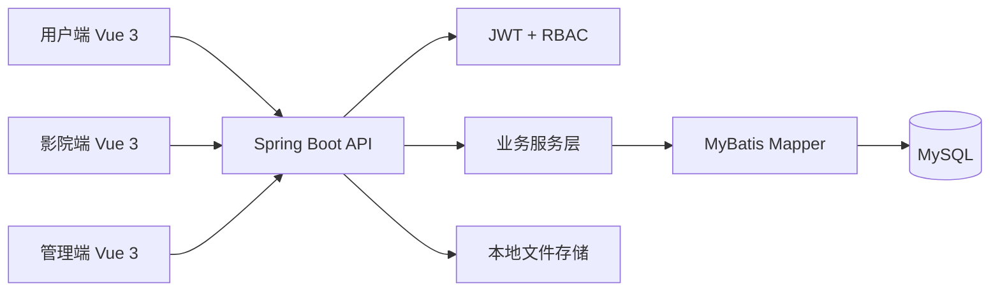

# 多角色影院票务运营平台

基于 **Spring Boot 3.3 + Vue 3 + MySQL** 构建的多角色影院票务运营平台，覆盖用户购票、影院排片、平台审核、订单流转、权限隔离与 CI 自动化构建。


## 在线演示

| 项目 | 地址 |
|------|------|
| 前端演示 | http://localhost:5173 |
| 后端健康检查 | http://localhost:9090/api/v1/health |

## 测试账号

| 角色 | 用户名 | 密码 |
|------|--------|------|
| 管理员 | 999 | 999 |
| 影院管理员 | asks | cinema123 |
| 普通用户 | zhangsan | user123 |

**代码质量**: 单元测试覆盖核心 Service 与权限边界（193 用例），BCrypt 密码加密 + JWT 认证 + RBAC 权限控制，GitHub Actions CI 流水线。

---

## 项目亮点

- **多角色 RBAC**：管理员、影院端、用户端分离，后端拦截器和业务层共同保证权限边界。
- **订单一致性**：购票链路校验排片、座位、订单状态，防止重复购票和越权操作。
- **工程化验证**：GitHub Actions 自动执行后端编译与前端构建。
- **部署交付**：生产配置通过环境变量注入，后端裸 jar 启动 + Nginx 反代静态资源。
- **文档闭环**：CLAUDE.md、README.md、Bug 复盘与代码、数据库同步维护。

---

## 目录

- [项目亮点](#项目亮点)
- [技术栈](#技术栈)
- [项目结构](#项目结构)
- [架构概览](#架构概览)
- [快速启动](#快速启动)
- [配置说明](#配置说明)
- [功能模块](#功能模块)
- [API 概览](#api-概览)
- [数据库设计](#数据库设计)
- [安全机制](#安全机制)
- [部署指南](#部署指南)
- [相关文档](#相关文档)

---

## 技术栈

### 后端

| 技术 | 版本 | 用途 |
|------|------|------|
| Spring Boot | 3.3.13 | 应用框架 |
| Java | 17 | 运行环境 |
| MyBatis | 3.0.4 | ORM 持久层 |
| MySQL | 8.0 | 数据库 |
| PageHelper | 1.4.6 | 分页插件 |
| JJWT | 0.11.5 | JWT 令牌认证 |
| Spring Security Crypto | - | BCrypt 密码加密 |
| Fastjson | 2.0.33 | JSON 处理 |
| Lombok | - | 代码简化 |
| Commons Lang3 | 3.14.0 | 工具类库 |

### 前端

| 技术 | 版本 | 用途 |
|------|------|------|
| Vue | 3.5.13 | 前端框架 |
| Vite | 6.2.4 | 构建工具 |
| Element Plus | 2.9.11 | UI 组件库 |
| Vue Router | 4.5.0 | 路由管理 |
| Axios | 1.9.0 | HTTP 请求 |
| ECharts | 6.0.0 | 数据可视化 |
| wangEditor | 5.x | 富文本编辑器 |
| Sass | 1.89.0 | CSS 预处理器 |

---

## 项目结构

```
xm_film/
├── springboot/                        # 后端（Spring Boot）
│   └── src/main/java/com/example/springboot/
│       ├── common/                    # 公共组件
│       │   ├── BaseController.java    # 泛型 CRUD 控制器基类（7 个标准接口）
│       │   ├── BaseService.java       # 泛型 CRUD Service 基类
│       │   ├── BaseMapper.java        # MyBatis 通用 Mapper 接口
│       │   ├── config/
│       │   │   ├── AuthInterceptor.java   # JWT 认证拦截器
│       │   │   └── WebMvcConfig.java      # Web MVC 配置
│       │   ├── CorsConfig.java        # CORS 跨域配置
│       │   ├── FileUtil.java          # 文件上传工具类
│       │   ├── JwtUtils.java          # JWT 令牌工具
│       │   └── Result.java            # 统一响应封装
│       ├── controller/                # 控制器层（16个）
│       │   ├── AuthController.java    # 登录/注册/密码修改（原 WebController）
│       │   ├── FileUploadController.java # 文件上传
│       │   └── 14 个资源 Controller    # 继承 BaseController，3-15 行代码
│       ├── entity/                    # 实体类
│       ├── mapper/                    # MyBatis Mapper 接口
│       ├── service/                   # 业务逻辑层
│       └── exception/                 # 异常处理
│   └── src/main/resources/
│       ├── application.yml            # 应用配置
│       └── mapper/                    # MyBatis XML 映射
│           ├── FilmMapper.xml
│           ├── AdminMapper.xml
│           ├── UserMapper.xml
│           ├── CinemaMapper.xml
│           ├── ActorMapper.xml
│           ├── AreaMapper.xml
│           ├── TypeMapper.xml
│           ├── NoticeMapper.xml
│           ├── OrderedMapper.xml
│           ├── RecordMapper.xml
│           ├── RoomMapper.xml
│           ├── MarkMapper.xml
│           ├── MarkLikeMapper.xml
│           ├── VideoMapper.xml
│           ├── FundFlowMapper.xml
│           └── RechargeOrderMapper.xml
│
├── vue/                               # 前端（Vue 3）
│   └── src/
│       ├── views/                     # 页面视图
│       │   ├── Login.vue              # 登录页
│       │   ├── Register.vue           # 注册页
│       │   ├── Front.vue              # 用户前台布局
│       │   ├── Back.vue               # 影院后台布局
│       │   ├── Manage.vue             # 管理后台布局
│       │   ├── front/                 # 用户端页面
│       │   │   ├── Home.vue           # 首页
│       │   │   ├── Movie.vue          # 影片列表
│       │   │   ├── FilmDetail.vue     # 影片详情
│       │   │   ├── Cinema.vue         # 影院列表
│       │   │   ├── CinemaDetail.vue   # 影院详情
│       │   │   ├── FilmCinema.vue     # 影片排片
│       │   │   ├── BuyTicket.vue      # 购票选座
│       │   │   ├── Orders.vue         # 我的订单
│       │   │   ├── Rank.vue           # 排行榜
│       │   │   ├── Search.vue         # 搜索
│       │   │   ├── Person.vue         # 个人资料
│       │   │   └── Password.vue       # 修改密码
│       │   ├── back/                  # 影院端页面
│       │   │   ├── Home.vue           # 影院首页
│       │   │   ├── Film.vue           # 影片管理
│       │   │   ├── Room.vue           # 影厅管理
│       │   │   ├── Record.vue         # 排片管理
│       │   │   ├── Ordered.vue        # 订单管理
│       │   │   ├── Person.vue         # 个人资料
│       │   │   └── Password.vue       # 修改密码
│       │   └── manage/                # 管理后台页面
│       │       ├── Home.vue           # 首页仪表盘
│       │       ├── Admin.vue          # 管理员管理
│       │       ├── User.vue           # 用户管理
│       │       ├── Cinema.vue         # 影院审核
│       │       ├── Film.vue           # 影片管理
│       │       ├── Actor.vue          # 演职人员
│       │       ├── Type.vue           # 电影分类
│       │       ├── Area.vue           # 地区管理
│       │       ├── Notice.vue         # 公告管理
│       │       ├── Room.vue           # 影厅管理
│       │       ├── Record.vue         # 放映记录
│       │       ├── Ordered.vue        # 订单管理
│       │       ├── Video.vue          # 预告片管理
│       │       ├── Mark.vue           # 评价管理
│       │       ├── Person.vue         # 个人资料
│       │       └── Password.vue       # 修改密码
│       ├── composables/               # 组合式 API
│       │   ├── useAuth.js             # 认证状态管理
│       │   ├── useCrud.js             # 通用 CRUD 操作
│       │   └── useFormDialog.js       # 表单弹窗控制
│       ├── constants/index.js         # 常量（角色/状态映射）
│       ├── utils/
│       │   ├── request.js             # Axios 封装
│       │   ├── format.js              # 格式化工具
│       │   └── status.js              # 状态工具函数
│       └── assets/                    # 静态资源
```

---

## 架构概览


```mermaid
flowchart LR
  User[用户端 Vue 3] --> API[Spring Boot API]
  Cinema[影院端 Vue 3] --> API
  Admin[管理端 Vue 3] --> API
  API --> Auth[JWT + RBAC]
  API --> Service[业务服务层]
  Service --> MyBatis[MyBatis Mapper]
  MyBatis --> MySQL[(MySQL)]
  API --> Upload[本地文件存储]
```

## 架构设计

### 后端泛型三层架构

系统采用泛型基类抽象消除 90% 重复 CRUD 代码：

| 层级 | 基类 | 职责 |
|------|------|------|
| Controller | `BaseController<T>` | 提供 7 个标准 RESTful 端点（list/getById/page/add/update/delete/deleteBatch） |
| Service | `BaseService<T>` | 提供 CRUD 方法 + `@Transactional` 事务管理 |
| Mapper | `BaseMapper<T>` | 提供 MyBatis CRUD 方法定义 |

- 13 个 Service 全部继承 `BaseService<T>`，仅需实现 `mapper()` 方法
- 13 个 Controller 继承 `BaseController<T>`，仅需声明 `@RequestMapping` + 构造函数注入（3-15 行代码）
- 复杂业务（Film 排行榜、Cinema 按电影筛选）通过方法覆写实现

### 前端 Composable 架构

| Composable | 职责 |
|------------|------|
| `useAuth` | 认证状态管理、登录/登出、角色判断 |
| `useCrud` | 通用 CRUD 操作（增删改查/分页/批量删除） |
| `useFormDialog` | 表单弹窗状态控制（打开/关闭/提交） |

---

## 快速启动

### 环境要求

- JDK 17+
- Maven 3.6+
- MySQL 8.0+
- Node.js 18+
- npm 9+

### 1. 初始化数据库

```sql
CREATE DATABASE `xm-film` DEFAULT CHARACTER SET utf8mb4 COLLATE utf8mb4_unicode_ci;
```

执行项目提供的 `xm_film/sql/init.sql` 一键初始化脚本（或依次执行 `schema.sql` + `data.sql`）。使用 MySQL 客户端导入时请指定 `--default-character-set=utf8mb4`，避免中文默认值和初始数据在不同终端编码下被错误解析。

> `data.sql` 只预置基础数据（管理员 / 演示用户 / 影院 / 影厅 / 影片 / 词表）。**放映场次、购票订单、用户评价不预置** —— 它们只能经真实业务接口产生（前台下单 → 支付 → 取票 → 评价），不要用 `INSERT` 手工补：手写交易数据无法自证一致。

### 2. 启动后端

```bash
cd xm_film/springboot
mvn clean package -DskipTests
java -jar target/springboot-0.0.1-SNAPSHOT.jar
```

服务默认启动在 `http://localhost:9090`。

### 3. 启动前端

```bash
cd xm_film/vue
npm install
npm run dev
```

前端默认启动在 `http://localhost:5173`（端口可能因占用自增为 5174/5175）。

### 4. 默认账号

> 管理员账号 `999`、影院账号 `asks` 和用户 `zhangsan` 均通过 `data.sql` 初始化，默认账号见顶部表格。

### 5. API 文档（Swagger）

启动后端后访问：

```
http://localhost:9090/swagger-ui.html
```

所有 API 接口自动生成文档，支持在线调试（需先获取 JWT Token 登录）。

> 注意：Swagger UI 从 CDN 加载，服务端无需额外依赖，首次加载需联网。

---

## 配置说明

核心配置位于 `application.yml`：

```yaml
# 服务端口
server:
  port: 9090

# 数据库连接
spring:
  datasource:
    url: jdbc:mysql://localhost:3306/xm-film
    username: root
    password: 123456

# JWT 认证
jwt:
  secret: xm-film-secret-key-...      # 生产环境请修改
  expire: 86400000                    # 24小时过期

# 文件上传
file:
  upload-dir: D:/project/picture      # 文件存储路径
  max-file-size: 50MB                 # 单文件大小限制
```

> 生产环境建议通过环境变量注入敏感配置：
> - `DB_PASSWORD` — 数据库密码（默认 `123456`）
> - `JWT_SECRET` — JWT 签名密钥
> - `FILE_UPLOAD_DIR` — 文件上传存储路径
> - `MYBATIS_LOG_LEVEL` — SQL 日志级别（默认 `DEBUG`）
>
> 前端后端地址在 `vue/.env` 中通过 `VITE_API_BASE_URL` 配置，修改一处即可切换环境。
>
> CI 环境使用 `application-ci.yml` 独立配置（MySQL host、日志级别、上传目录）。

---

## 功能模块

### 三端角色

| 角色 | 名称 | 职责 |
|------|------|------|
| ADMIN | 系统管理员 | 全局配置、审核影院、管理所有数据 |
| CINEMA | 影院管理员 | 管理本影院影厅、排片、订单 |
| USER | 普通用户 | 浏览影片、购票、评价 |

### 核心功能

- **影片管理** — 影片 CRUD、分类/地区关联、演员关联、预告片上传
- **影院管理** — 影院注册审核（未审核既不可登录也不对外展示，管理员审核入口）、信息维护、影厅管理
- **排片管理** — 创建放映场次（关联影厅、时间、价格）
- **在线选座** — 按影厅座位规模渲染的可视化座位图、选定下单；座位占用接口只返回「座位 + 是否本人」投影，归属由后端按 JWT 判定，不泄露他人订单明细
- **订单系统** — 购票下单、订单状态流转（含超时取消、取票、退票）与支付/退款凭证留痕；订单留存单价快照，场次改价不影响历史订单
- **账户与资金** — 用户账户余额、充值单据（处理中/已完成/已失败）、资金流水账本（充值/购票/退票三类来源，记录变动前后余额与关联单据ID）。**购票为余额支付**：支付时校验余额并原子扣减，余额不足则支付失败、订单保持待支付且座位继续锁定；退票时金额退回余额。充值走"提交单据 + 模拟支付回调"两步，提交单据不改余额，回调成功才入账，重复回调被拒
- **评价系统** — 已取票用户对影片评分 + 评语（一人一片一条，可修改），均分回写 `film.score` 并驱动评分榜；入口在购票记录的「去评价/修改评价」，落到**影评页** `/front/filmMarks/:id`（游客可读）：全部评价按赞数降序分页、可写/改自己的评价。影片详情页展示「用户热评」（同一条排序的前 3 条）
- **评价点赞** — 对别人的评价点赞/取消（一人一赞、可取消），赞数按 `mark_like` 实时 `COUNT(*)` 聚合、不落计数列；`PUT /api/v1/marks/{id}/like` 仅 USER 可用，游客可见赞数、点赞时引导登录
- **排行榜** — 票房榜（按订单实时聚合的累计售票收入）、评分榜（按评价均分）
- **搜索筛选** — 按影片名称、类型、年份、地区多维筛选
- **文件上传** — 图片/视频上传，支持本地存储

---

## API 概览

### 通用 CRUD 接口（每个资源模块，继承 `BaseController<T>`）

| 路径 | 方法 | 说明 |
|------|------|------|
| `/api/v1/{resources}` | GET | 查询全部（支持筛选） |
| `/api/v1/{resources}/{id}` | GET | 按 ID 查询 |
| `/api/v1/{resources}/page` | GET | 分页查询 |
| `/api/v1/{resources}` | POST | 新增 |
| `/api/v1/{resources}` | PUT | 更新 |
| `/api/v1/{resources}/{id}` | DELETE | 删除 |
| `/api/v1/{resources}/batch` | DELETE | 批量删除 |

> `resources` 取值：`admins`、`users`、`cinemas`、`films`、`actors`、`areas`、`types`、`notices`、`rooms`、`records`、`orders`、`marks`、`videos`

> 充值单据（`recharges`）与资金流水（`fund-flows`）**不是**通用 CRUD 资源：单据是资金凭证、账本只增不改，只有下面列出的显式端点，不暴露 PUT/DELETE。

### 认证与公共接口

| 路径 | 方法 | 说明 | 认证 |
|------|------|------|------|
| `/api/v1/auth/login` | POST | 用户登录（三端共用） | 否 |
| `/api/v1/auth/register` | POST | 用户/影院注册 | 否 |
| `/api/v1/auth/password` | PUT | 修改密码 | Bearer |
| `/api/v1/auth/years` | GET | 获取年份列表 | 否 |

### 业务接口

| 路径 | 方法 | 说明 | 认证 |
|------|------|------|------|
| `/api/v1/films/box-office/top` | GET | 票房排行榜 Top10（按订单实时聚合，只统计已支付） | 否 |
| `/api/v1/films/mark/top` | GET | 评分排行榜 Top5 | 否 |
| `/api/v1/films/search` | GET | 按标题搜索 | 否 |
| `/api/v1/films/by-cinema` | GET | 按影院查询电影 | Bearer |
| `/api/v1/cinemas/page` | GET | 影院分页（支持按电影筛选） | 否 |
| `/api/v1/statistics/overview` | GET | 后台可视化大盘（影院状态分布 + 影片类型分布，实时聚合） | Bearer（ADMIN） |
| `/api/v1/files/upload` | POST | 文件上传 | Bearer |
| `/api/v1/account/summary` | GET | 当前登录用户账户余额 | Bearer |
| `/api/v1/recharges` | POST | 提交充值申请（生成「处理中」单据，余额不变） | Bearer |
| `/api/v1/recharges/page` | GET | 充值单据分页（USER 只看自己的） | Bearer |
| `/api/v1/recharges/{id}/callback` | POST | 模拟支付网关回调（幂等，终态不可再流转） | Bearer |
| `/api/v1/fund-flows/page` | GET | 资金流水分页（USER 只看自己的） | Bearer |
| `/api/v1/marks/by-film` | GET | 某片评价列表（按赞数降序→id 降序分页，附带本人评价与「是否够格发表」；`liked`/`mine` 由后端按 JWT 算出，投影不含 `userId`） | 否 |
| `/api/v1/marks/{id}/like` | PUT | 点赞/取消点赞（`{"liked":true\|false}` 是显式意图而非 toggle，重复调用幂等；写库后回读权威状态再返回） | Bearer（USER） |

统一响应格式：

```json
{
  "code": "200",
  "msg": "请求成功",
  "data": { ... }
}
```

---

## 数据库设计

系统共 17 张核心表：

| 表名 | 说明 | 关键字段 |
|------|------|----------|
| `admin` | 系统管理员 | username, password, name, role |
| `user` | 普通用户 | username, password, name, phone, balance（账户余额，资金唯一可信来源） |
| `cinema` | 影院 | name, address, phone, status（未审核/已审核） |
| `film` | 电影 | title, content, score（由评价均分回写）, boxOffice（多对多关联 type） |
| `film_type` | 电影-类型关联（多对多） | film_id, type_id |
| `actor` | 演职人员 | actor, title, figure, grade |
| `area` | 地区 | title |
| `type` | 电影分类 | title |
| `notice` | 系统公告 | title, content, time |
| `room` | 影厅 | name, title, cinema_id, seat_rows, seat_cols |
| `record` | 放映记录（排片） | film_id, cinema_id, room_id, start, price, status |
| `ordered` | 购票订单 | record_id, user_id, seat, total, unit_price（单价快照）, status, pay_time/refund_time |
| `mark` | 用户评价 | film_id, user_id, score（评分 0~10，影片评分的唯一数值来源）, mark（评语） |
| `mark_like` | 评价点赞（一人一赞，可取消） | mark_id, user_id（两者为复合主键；刻意不设计数列，赞数由 `COUNT(*)` 聚合） |
| `video` | 预告片 | film_id, url, title |
| `recharge_order` | 充值单据 | recharge_no, user_id, amount, status（处理中/已完成/已失败） |
| `fund_flow` | 资金流水（只增不改不删） | user_id, source（充值/购票/退票）, change_amount, balance_before, balance_after, related_id |

> 密码字段统一使用 BCrypt 加密存储（兼容旧版明文密码迁移）。

> 影院"上映哪些影片"由 `record`（排片）派生，没有独立的影院-影片关联表；
> 订单引用的影片/影院/影厅/场次/用户均为 `ON DELETE RESTRICT`，需下架时改状态而不做物理删除。

> `record` / `ordered` / `mark` 三张表**不预置种子数据**：手写的订单必须同时伪造单号、单价快照、支付凭证、余额扣减与资金流水，任意一处对不上就是可被查出的假数据。演示数据只能经真实业务接口生成（前台下单 → 支付 → 取票 → 评价），不要手工 `INSERT`。
> `film.box_office` 已废弃（票房改由订单实时聚合），存量库用 `migration-20260929-deprecate-box-office.sql` 清零。
> **已有数据库**还需执行 `migration-20260929-mark-like.sql`（新增 `mark_like` 评价点赞表；幂等、只增不删）。未执行时影评页与点赞会报表不存在。

---

## 安全机制

- **密码加密** — BCrypt 哈希存储，`add()` 自动加密，`login()` 通过 `matches()` 验证（兼容 `data.sql` 明文密码迁移）
- **JWT 令牌** — 基于 JJWT 的 Bearer Token 认证，24 小时过期，密钥可环境变量配置
- **认证拦截** — `AuthInterceptor` 拦截除公开路径外的所有接口，校验 Token 有效性
- **角色访问控制** — `AuthInterceptor` 对 ADMIN/CINEMA/USER 路径校验对应角色，不匹配返回 403
- **批量赋值防护** — Service 层 `update()` 方法置空 `password`/`role`，防止通过 `@RequestBody` 篡改敏感字段
- **密码序列化防护** — `@JsonProperty(WRITE_ONLY)` 注解阻止密码字段在 API 响应中泄露
- **事务保护** — 所有 Service 类均标注 `@Transactional(rollbackFor = Exception.class)`，确保数据一致性
- **XSS 防护** — 前端使用 Element Plus 内置转义
- **上传限制** — 文件大小限制 50MB，防恶意大文件上传
- **CORS 配置** — 统一跨域处理，预检缓存 1 小时

---

## 部署指南

### 生产构建

```bash
# 后端
cd xm_film/springboot
mvn clean package -DskipTests
java -jar target/springboot-0.0.1-SNAPSHOT.jar --spring.profiles.active=prod

# 前端
cd xm_film/vue
npm run build    # 输出到 dist/
```

### 环境变量注入

```bash
# Linux / macOS
export DB_PASSWORD=your_secure_password
export JWT_SECRET=your_long_random_secret

# Windows PowerShell
$env:DB_PASSWORD = "your_secure_password"
$env:JWT_SECRET = "your_long_random_secret"
```

### Nginx 反向代理示例

```nginx
server {
    listen 80;
    server_name your-domain.com;

    # 前端静态文件
    root /path/to/vue/dist;
    index index.html;

    # API 代理
    location / {
        try_files $uri $uri/ /index.html;
    }

    location /api/ {
        proxy_pass http://127.0.0.1:9090;
        proxy_set_header Host $host;
        proxy_set_header X-Real-IP $remote_addr;
    }

    location /files/ {
        proxy_pass http://127.0.0.1:9090;
    }
}
```

---

## 测试

### 单元测试（193 用例）

```bash
cd xm_film/springboot
mvn test
```

覆盖核心 Service（Admin/User/Cinema/Film/Ordered/Mark/Wallet/Recharge/FundFlow）及权限拦截、异常处理、健康检查模块，包括登录认证、密码加密、注册去重、密码修改、批量赋值防护、排行榜查询、类型关联维护、订单状态流转、座位冲突检测、RBAC 权限边界、全局异常处理，以及**账户资金**（余额足额/不足扣减、退款入账、金额非正拒绝、流水前后余额与关联单据）、**充值单据状态机**（提交不改余额、回调成功/失败、重复回调被拒、金额上限、跨用户回调被拒）、**订单删除守卫**（按状态拒绝）、**评价点赞**（显式 `liked` 意图幂等、仅 USER 可点赞、投影不下发 `userId`、`reviewable` 的已取票口径）等业务逻辑。

> **Mockito 打桩后测到的是桩，不是 SQL。** 赞数聚合、`ORDER BY likeCount DESC, id DESC` 的并列裁决、以及事务隔离下"回读是否为最新已提交快照"，这三类单测覆盖不到，只能在真库上验证。

### 本地复现 CI

```bash
cd xm_film/springboot
mvn clean package

cd ../vue
npm install
npm run build
```

---

## 相关文档

- [Bug 修复记录](Bug.md) — 已修复 Bug 的根因分析与解决方案
- [数据库说明](xm_film/sql/README.md) — 数据库表设计与初始化指引

---

## License

MIT License

## Current Architecture Notes

- Authentication state is centralized in `xm_film/vue/src/utils/authStorage.js`; router guards, Axios token injection, password pages, profile pages, and ticket purchase use the same storage helpers.
- Backend password changes trust the JWT-derived request role instead of the request body role.
- `AuthInterceptor` enforces role boundaries for admin-only resources and write operations on protected resources.
- Database relations now use explicit keys for the main booking path: `room.cinema_id`, `record.film_id`, and `ordered.record_id`; `xm_film/sql` is the single source of truth for both schema and seed data.
- `user.balance` is the single source of truth for account funds; `fund_flow` is an append-only audit copy. Every balance mutation must go through `WalletService` (`creditRecharge` / `debitPurchase` / `creditRefund`), which does row-lock read → validate/mutate → write one ledger row inside one transaction. Going around it skips the ledger and the balance check.
- Balance deduction is `SELECT balance ... FOR UPDATE` plus a conditional `UPDATE ... WHERE balance >= ?`. Both layers exist so a concurrent payment can never overdraw.
- Recharge is a two-step flow: submitting an application only creates a `处理中` voucher and does **not** move the balance; only a successful callback flips it to `已完成` and credits the account. Terminal vouchers cannot be re-processed, which is how callback idempotency is implemented — there is no separate idempotency key.
- Order payment is balance-based: `payOrder` deducts in the same transaction as issuing the ticket, so insufficient balance rolls the whole thing back and leaves the order `待支付` with its seat still locked. Refunds credit the balance back.
- Order hard delete is limited to terminal waste states (`已取消` / `已退票`) via `OrderedService.DELETABLE_STATUSES`; the front end mirrors this with `constants.isOrderDeletable`. Deleting a paid order would otherwise function as a refund that skips the money movement.
- Balance is deliberately **not** a field on the `User` entity — `/api/v1/users` is a `SELECT *` generic query, so putting it there would publish every user's balance. It is only served per-JWT at `/api/v1/account/summary`.
