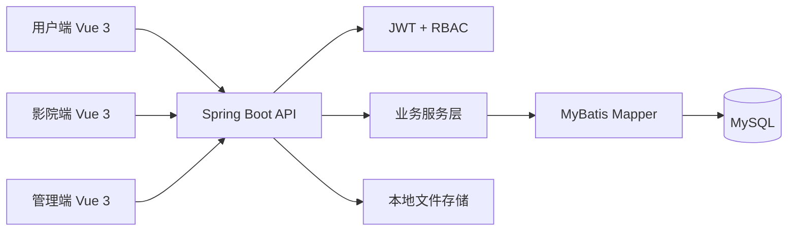

# 多角色影院票务运营平台

基于 **Spring Boot 3.3 + Vue 3 + MySQL** 构建的多角色影院票务运营平台：覆盖用户购票、影院排片、平台审核、订单与资金流转、权限隔离与 CI 自动化构建。


## 在线演示

| 项目 | 地址 |
|------|------|
| 前端演示 | http://localhost:5173 |
| 后端健康检查 | http://localhost:9090/api/v1/health |
| API 文档（Swagger UI） | http://localhost:9090/swagger-ui.html |

## 测试账号

| 角色 | 用户名 | 密码 | 支付密码 |
|------|--------|------|----------|
| 管理员 | 999 | 999 | — |
| 影院管理员 | asks | cinema123 | — |
| 普通用户 | zhangsan | user123 | 123456 |

> 支付密码只有普通用户有（只有 `user` 表有账户余额）。三个演示账号预置为 `123456`；新注册账号未设置，首次余额支付时会引导去 `/front/payPassword` 设置。

**代码质量**：205 个单元测试用例覆盖核心 Service 与权限边界；BCrypt 密码加密 + JWT 认证 + RBAC 权限控制；GitHub Actions CI 流水线（后端编译 → 前端构建）。

---

## 目录

- [项目亮点](#项目亮点)
- [功能模块](#功能模块)
- [技术栈](#技术栈)
- [项目结构](#项目结构)
- [架构概览](#架构概览)
- [快速启动](#快速启动)
- [配置说明](#配置说明)
- [API 概览](#api-概览)
- [数据库设计](#数据库设计)
- [安全机制](#安全机制)
- [测试](#测试)
- [部署指南](#部署指南)
- [后续计划](#后续计划)
- [相关文档](#相关文档)

---

## 项目亮点

- **多角色 RBAC** —— 管理员端、影院端、用户端三端分离，后端 `AuthInterceptor` 与业务层共同保证权限边界。
- **订单与资金一致性** —— 购票为**余额支付**：支付时校验支付密码（与登录密码相互独立的 6 位凭证，连续错 5 次锁定 15 分钟），再做行锁校验与原子扣减，扣款与出票同一事务；余额不足则整体回滚，订单保持待支付。退票回款、充值入账全程写入只增的资金流水账本。
- **取票凭证闭环** —— 支付成功即生成一次性取票码（一单一码），柜台核销与自助机核销共用「待取票 → 已取票」这一条状态边；码的有效性完全由订单状态派生，无需额外的失效标记。
- **工程化验证** —— GitHub Actions 自动执行后端编译与前端构建；单元测试覆盖权限边界、订单状态机与资金规则。
- **文档闭环** —— 每类事实在文档中有唯一落点（见 [CONTRIBUTING.md · 文档归属](CONTRIBUTING.md#三文档归属一处事实一处归属)），代码、数据库与文档同步维护。

---

## 功能模块

### 三端角色

| 角色 | 名称 | 职责 |
|------|------|------|
| ADMIN | 系统管理员 | 全局配置、审核影院、管理所有数据 |
| CINEMA | 影院管理员 | 管理本影院影厅、排片、订单 |
| USER | 普通用户 | 浏览影片、购票、取票、评价 |

### 核心功能

- **影片管理** —— 影片 CRUD、分类 / 地区 / 演员关联、预告片上传
- **影院管理与审核** —— 影院注册后为「未审核」，既不可登录也不对外展示；管理员审核通过后才进入公开列表
- **排片管理** —— 创建放映场次（关联影片、影厅、时间、票价），校验开映时间晚于当前、票价大于 0、同影厅时段不重叠
- **在线选座** —— 按影厅座位规模（`room.seat_rows` × `seat_cols`）渲染可视化座位图；占用座位接口只返回「座位 + 是否本人」投影，归属由后端按 JWT 判定，不泄露他人订单明细
- **订单系统** —— 购票下单与状态流转（待支付 → 待取票 → 已取票；旁支为取消 / 超时取消 / 退票）；订单留存**单价快照**，场次改价不影响历史订单
- **取票与取票大厅** —— 支付成功即生成取票码（`XXXX-XXXX`）；前台「取票大厅」模拟影院自助机，凭码核销出票。该核销端点是全站唯一的免登录写接口（码本身即凭证），有效期到放映结束
- **账户与资金** —— 用户账户余额、支付密码（6 位，独立于登录密码，余额支付时的确认凭证）、充值单据（处理中 / 已完成 / 已失败）、资金流水账本（充值 / 购票 / 退票三类来源，记录变动前后余额与关联单据）。充值走「提交单据 + 模拟支付回调」两步：提交不改余额，回调成功才入账，重复回调被拒
- **评价系统** —— **已取票**用户对影片评分 + 评语（一人一片一条，可修改），均分回写并驱动评分榜；影片详情页与影评页公开展示评价列表
- **评价点赞** —— 登录用户可为任一评价点赞 / 取消（一人一赞、可取消），赞数实时聚合；评价列表按赞数降序排列，热评即其头部
- **排行榜** —— 票房榜 Top10（按订单实时聚合的累计售票收入）、评分榜 Top5（按评价均分，**无评价的影片不上榜**）；首页另展示「今日票房」（今天支付的售票收入合计，匿名可读）
- **搜索筛选** —— 按影片名称、类型、年份、地区多维筛选
- **文件上传** —— 图片 / 视频上传，本地存储，MIME 白名单校验

---

## 技术栈

### 后端

| 技术 | 版本 | 用途 |
|------|------|------|
| Spring Boot | 3.3.13 | 应用框架 |
| Java | 17 | 运行环境 |
| MyBatis Starter | 3.0.4 | ORM 持久层 |
| MySQL | 8.0 | 数据库 |
| PageHelper | 1.4.6 | 分页插件 |
| JJWT | 0.11.5 | JWT 令牌认证 |
| Spring Security Crypto | 由 Spring Boot 托管 | BCrypt 密码加密 |
| Jackson | 随 `starter-web` 传递引入 | JSON 序列化 |
| SpringDoc OpenAPI | 2.8.17 | API 文档（OpenAPI 规范 + Swagger UI） |
| Lombok | 由 Spring Boot 托管 | 代码简化 |

### 前端

| 技术 | 版本 | 用途 |
|------|------|------|
| Vue | 3.5.13 | 前端框架 |
| Vite | 6.4.3 | 构建工具 |
| Element Plus | 2.9.11 | UI 组件库 |
| Vue Router | 4.5.0 | 路由管理 |
| Axios | 1.9.0 | HTTP 请求 |
| ECharts | 6.0.0 | 数据可视化 |
| wangEditor | 5.1.23 | 富文本编辑器 |
| Sass | 1.89.0 | CSS 预处理器 |

---

## 项目结构

```
project_02/
├── README.md / CONTRIBUTING.md / CLAUDE.md / Bug.md   # 文档（各文件职责见 CONTRIBUTING 归属表）
├── 标准前端视觉与交互设计规范.md / 前端规范待办.md
├── .github/workflows/ci.yml               # CI：后端编译 → 前端构建
└── xm_film/
    ├── springboot/                        # 后端（Spring Boot）
    ├── vue/                               # 前端（Vue 3）
    └── sql/                               # 数据库初始化（init.sql 一键入口）
```

> 这里是两层概览；**完整目录树（逐文件注解）**、API 接口清单与页面清单见 [CLAUDE.md](CLAUDE.md#目录结构)。

---

## 架构概览


```mermaid
flowchart LR
  User[用户端 Vue 3] --> API[Spring Boot API]
  Cinema[影院端 Vue 3] --> API
  Admin[管理端 Vue 3] --> API
  API --> Auth[JWT + RBAC]
  API --> Service[业务服务层]
  Service --> MyBatis[MyBatis Mapper]
  MyBatis --> MySQL[(MySQL)]
  API --> Upload[本地文件存储]
```

后端采用**泛型三层抽象**消除重复 CRUD 代码：`BaseController<T>` 提供 7 个标准 RESTful 端点，`BaseService<T>` 提供事务化的 CRUD 方法，`BaseMapper<T>` 提供 SQL 方法定义。13 个资源 Controller 与 13 个 Service 继承基类，各只需实现一个方法；复杂业务（票房榜、按片筛选、订单状态机）通过方法覆写或独立端点扩展。设计取舍见 [CLAUDE.md · 后端抽象](CLAUDE.md#后端抽象)。

---

## 快速启动

### 环境要求

- JDK 17+
- Maven 3.6+
- MySQL 8.0+
- Node.js 18+
- npm 9+

### 1. 初始化数据库

```bash
cd xm_film/sql
mysql --default-character-set=utf8mb4 -u root -p < init.sql
```

或手动分步执行：

```sql
CREATE DATABASE `xm-film` DEFAULT CHARACTER SET utf8mb4 COLLATE utf8mb4_unicode_ci;
USE `xm-film`;
SOURCE xm_film/sql/schema.sql;
SOURCE xm_film/sql/data.sql;
```

> **`init.sql` 是唯一的初始化路径。** `schema.sql` 已含全部 17 张表与所有列，不存在需要补执行的脚本。
> **已存在的库请重建**：`DROP DATABASE \`xm-film\`;` 后重跑 `init.sql` —— 项目不提供增量迁移脚本。
> 详见 [数据库说明](xm_film/sql/README.md)。

### 2. 启动后端

```bash
cd xm_film/springboot
mvn clean package -DskipTests
java -jar target/springboot-0.0.1-SNAPSHOT.jar
```

后端默认运行在 `http://localhost:9090`。

### 3. 启动前端

```bash
cd xm_film/vue
npm install
npm run dev
```

前端默认运行在 `http://localhost:5173`（端口被占用时会自增为 5174/5175）。开发期前端直连 `http://localhost:9090`，见下节。

### 4. 默认账号

见顶部 [测试账号](#测试账号) 表格 —— 三个账号均由 `data.sql` 初始化。

---

## 配置说明

后端配置位于 `xm_film/springboot/src/main/resources/`：`application.yml`（开发，默认生效）与 `application-prod.yml`（生产，`--spring.profiles.active=prod` 时叠加）。两者均通过环境变量注入：

| 变量 | 开发默认值 | 生产默认值 | 说明 |
|------|-----------|-----------|------|
| `DB_HOST` | `localhost` | `mysql` | 数据库主机 |
| `DB_PORT` | — | `3306` | 数据库端口 |
| `DB_NAME` | `xm-film` | —（生产 URL 写死库名） | 数据库名 —— 便于用临时库做验证而不影响开发库 |
| `DB_USERNAME` | `root` | `root` | 数据库用户名 |
| `DB_PASSWORD` | `123456` | **无默认，必填** | 数据库密码 |
| `JWT_SECRET` | 内置开发密钥 | **无默认，必填** | JWT 签名密钥 |
| `JWT_EXPIRE` | `86400000` | `86400000` | JWT 过期毫秒数（24 小时） |
| `FILE_UPLOAD_DIR` | `D:/project/picture` | `/app/uploads` | 文件上传存储路径 |
| `FILE_ACCESS_PREFIX` | `http://localhost:9090/files/` | `/files/` | 上传文件的访问前缀 |
| `CORS_ALLOWED_ORIGINS` | `http://localhost:5173` | **无默认，必填** | 允许的跨域来源，需与前端端口一致 |
| `MYBATIS_LOG_IMPL` | `Slf4jImpl` | 同开发 | MyBatis 日志实现 |
| `MYBATIS_LOG_LEVEL` | `DEBUG` | `WARN` | mapper 包 SQL 日志级别 |
| `SERVER_PORT` | — | `9090` | 后端服务端口 |

> 生产 profile 另外会**关闭 Swagger**（`springdoc.api-docs.enabled: false`）。

**前端**通过 `VITE_API_BASE_URL` 指定后端地址：

| 文件 | 是否入库 | 用途 |
|------|----------|------|
| `.env.development` | ✅ 已入库 | 本地开发默认值（`http://localhost:9090`），`npm run dev` 自动加载 |
| `.env` | ❌ 不入库 | 生产构建默认值（`/`，同源经 Nginx 反代）；机器本地文件 |
| `.env.local` / `.env.*.local` | ❌ 不入库 | 本机覆盖，优先级最高 |

> 只放**非密钥**内容（本地地址、公开开关）。需要密钥时改用 `.env.*.local`。
> `VITE_API_BASE_URL` 全仓只有一个读取点（`src/constants/index.js`），未设置时回退为同源相对路径 `/`。
> axios 基地址、上传端点，以及库里存的 `/files/...` 相对路径，都按这一个值解析 —— 因此**没有 `.env` 的
> 全新克隆与 CI 构建**同样指向部署域名，而不是使用者本机。

---

## API 概览

所有接口以 `/api/v1` 为前缀，统一响应格式：

```json
{ "code": "200", "msg": "请求成功", "data": { } }
```

端点分为五组：

| 分组 | 前缀 | 说明 |
|------|------|------|
| 认证与公共 | `/api/v1/auth/**` | 登录、注册、改密、年份列表；公开只读资源匿名可放行 |
| 资源 CRUD | `/api/v1/{resources}` | 13 个资源的 7 个标准端点（list / getById / page / add / update / delete / batch） |
| 订单状态机 | `/api/v1/orders/**` | 下单、选座、支付、取消、取票、退票 —— 状态流转全部走显式端点，不支持通用 PUT |
| 账户与资金 | `/api/v1/account` · `/recharges` · `/fund-flows` | 余额查询、支付密码（设置 / 修改 / 重设）、充值单据、资金流水（单据与账本不暴露 PUT / DELETE） |
| 取票核销 | `/api/v1/tickets/redeem` | 取票大厅核销 —— **全站唯一免登录写接口**（码本身即凭证） |

> **完整端点清单、鉴权规则与各端权限边界**见 [CLAUDE.md · API 接口清单](CLAUDE.md#api-接口清单)。
> 运行时接口以 Swagger UI（`/swagger-ui.html`）为准，本文件不再复制一份端点表。

---

## 数据库设计

系统共 **17 张表**，单库 `xm-film`，全部 InnoDB + `utf8mb4`。设计要点：

- **资金三表** —— `user.balance` 是余额的唯一可信来源，`fund_flow` 是只增不改的审计副本，`recharge_order` 是充值凭证。任何改余额的代码只能走 `WalletService`，它在同一事务内完成「行锁读余额 → 校验 / 变更 → 写一条流水」。支付密码在 `user` 表另有 `pay_password` / `pay_pwd_error_count` / `pay_pwd_locked_until` 三列，与 `balance` 一样不挂实体、只经 `PayPasswordService` 读写。
- **交易数据不预置** —— `data.sql` 只播基础种子；`record`（场次）、`ordered`（订单）、`mark`（评价）、`mark_like`（点赞）的行一律由真实业务接口产生。手写的订单必须同时伪造单号、单价快照、支付凭证、余额扣减与资金流水，任意一处对不上就是能被查出的假数据。
- **派生列不接受入参** —— `film.score` 是纯派生列（由 `mark.score` 均分回写，无评价时为 `NULL`），`film.box_office` 已废弃；通用 CRUD 的 insert / update 刻意不写这两列。
- **父数据禁止物理删除** —— 订单、场次、影厅的外键均为 `ON DELETE RESTRICT`；需下架时改 `status`，不做物理删除。点赞关系表则相反，两个外键为 `ON DELETE CASCADE`（轻关系，随评价 / 用户消失）。
- **影院与影片无关联表** —— 影院「上映哪些影片」由排片 `record` 派生（`EXISTS` 子查询），新建排片后前台立即可见。

> 完整表清单、字段设计与外键策略见 [数据库说明](xm_film/sql/README.md)。

---

## 安全机制

- **密码加密** —— BCrypt 哈希存储，登录经 `matches()` 校验；密码字段带 `@JsonProperty(WRITE_ONLY)`，不会在 API 响应中泄露
- **JWT 令牌** —— Bearer Token 认证，24 小时过期，密钥可环境变量配置
- **认证拦截** —— `AuthInterceptor` 对公开只读资源按匿名放行，其余接口校验令牌有效性；令牌失效时公开资源仍按匿名放行（否则游客浏览公开页会被踢去登录页）
- **角色访问控制** —— 对 ADMIN / CINEMA / USER 分别校验角色，不匹配返回 403；权限判断一律写**白名单**，避免新增角色时静默扩权
- **最小放行面积** —— 全站只有一个匿名写入口（取票核销），且为**精确路径 + 仅 POST**；公开访问统一走 `PUBLIC_READ_PREFIXES`，不往 `excludePathPatterns` 里加路径（那会让拦截器不执行、控制器里的角色判断静默失效）
- **批量赋值防护** —— Service 层 `update()` 置空 `password` / `role`，防止经 `@RequestBody` 篡改敏感字段
- **数据脱敏** —— 选座接口与评价列表返回**投影**而非实体，归属只下发 `mine` 布尔量，不下发他人 `userId` / 订单号
- **事务保护** —— Service 层统一 `@Transactional(rollbackFor = Exception.class)`
- **上传限制** —— 单文件 50MB，MIME 白名单校验
- **CORS** —— 白名单来源，预检缓存 1 小时

---

## 测试

```bash
cd xm_film/springboot
mvn test
```

16 个测试类 / 205 个用例，覆盖核心 Service（Admin / User / Cinema / Film / Ordered / Mark / Wallet / Recharge / FundFlow / Statistics）与权限边界、订单状态机（支付超时 / 退票窗口 / 座位冲突与单笔上限 / **支付密码在扣款之前校验** / 验的是订单归属者的密码）、评价规则（评分区间 / 一人一片去重 / 均分回写 / **未取票不得评价**）、影院审核与可见性下推、账户资金（余额足额与不足、退款入账、流水前后余额）、充值单据状态机、订单删除守卫、取票码核销（一次性 / 退票作废 / 并发抢核销 / 输入归一化）、评价点赞（显式 `liked` 幂等、投影不下发 `userId`）。

> **Mockito 打桩后测到的是桩，不是 SQL。** SQL 谓词、唯一索引、状态条件更新、`ORDER BY` 的并列裁决与事务隔离级别这五类，单测覆盖不到，必须在**备用端口 + 临时库**上跑真实库验证。

### 本地复现 CI

```bash
cd xm_film/springboot && mvn clean package
cd ../vue && npm install && npm run build
```

---

## 部署指南

### 生产构建

```bash
# 后端
cd xm_film/springboot
mvn clean package -DskipTests
java -jar target/springboot-0.0.1-SNAPSHOT.jar --spring.profiles.active=prod

# 前端
cd xm_film/vue
npm run build    # 输出到 dist/
```

生产 profile（`application-prod.yml`）会禁用 Swagger，并**要求** `DB_PASSWORD` / `JWT_SECRET` / `CORS_ALLOWED_ORIGINS` 显式注入。

### 环境变量注入

```bash
# Linux / macOS
export DB_PASSWORD=your_secure_password
export JWT_SECRET=your_long_random_secret
export CORS_ALLOWED_ORIGINS=https://your-domain.com

# Windows PowerShell
$env:DB_PASSWORD = "your_secure_password"
$env:JWT_SECRET = "your_long_random_secret"
$env:CORS_ALLOWED_ORIGINS = "https://your-domain.com"
```

### Nginx 反向代理示例

```nginx
server {
    listen 80;
    server_name your-domain.com;

    # 前端静态文件
    root /path/to/vue/dist;
    index index.html;

    location / {
        try_files $uri $uri/ /index.html;
    }

    # API 代理
    location /api/ {
        proxy_pass http://127.0.0.1:9090;
        proxy_set_header Host $host;
        proxy_set_header X-Real-IP $remote_addr;
    }

    # 上传文件代理
    location /files/ {
        proxy_pass http://127.0.0.1:9090;
    }
}
```

---

## 相关文档

- [CONTRIBUTING.md](CONTRIBUTING.md) — 提交信息规范、分支实践、文档归属表
- [CLAUDE.md](CLAUDE.md) — 项目总览、架构约束、API / 页面清单、开发守则
- [Bug.md](Bug.md) — 已修复缺陷的根因分析与经验规则
- [数据库说明](xm_film/sql/README.md) — 表设计与初始化指引
- [前端设计规范](标准前端视觉与交互设计规范.md) — 三端视觉与交互标准
- [前端规范待办](前端规范待办.md) — 规范未落地条目与整改进度

---

## 后续计划

- **文件存储** —— 现为本地磁盘（`FILE_UPLOAD_DIR`），生产环境建议迁移至对象存储（OSS / S3）。
- **前端静态资源分发** —— 生产构建后建议接入 CDN。
- **API 文档** —— 静态资源走 CDN（`static/swagger-ui.html`）；离线环境需改用 `springdoc-openapi-starter-webmvc-ui` 本地内嵌。

---

## License

[MIT License](LICENSE) © 2026 renjianfeng8
