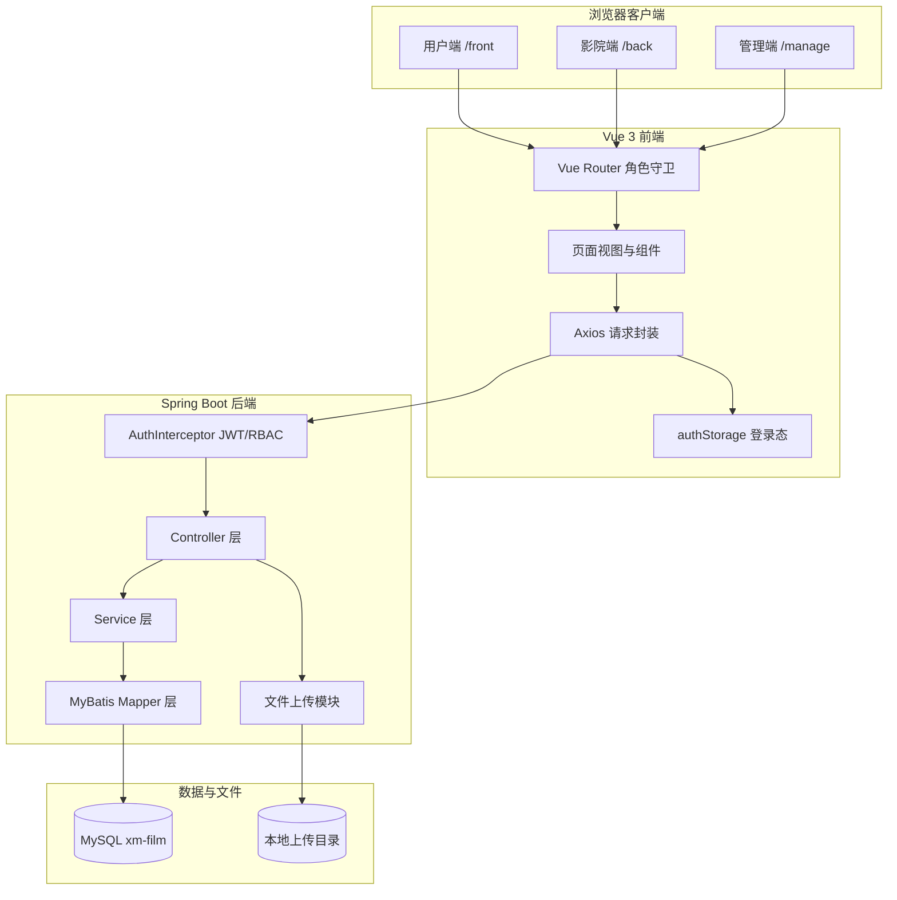
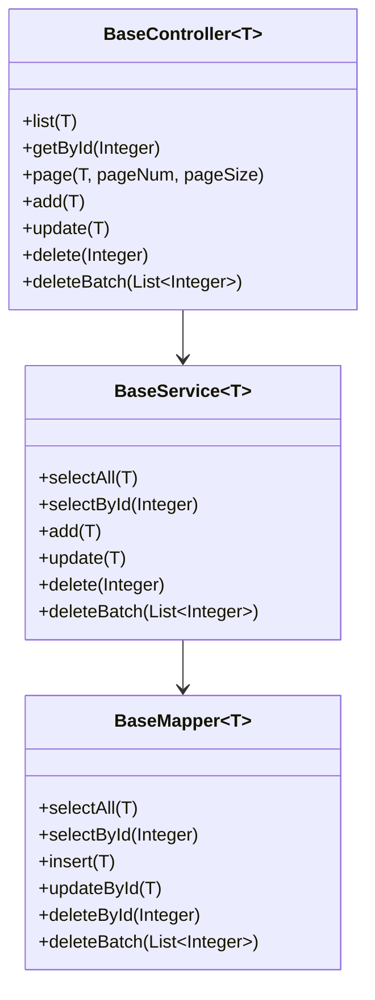
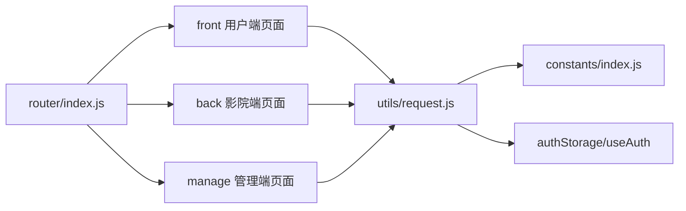
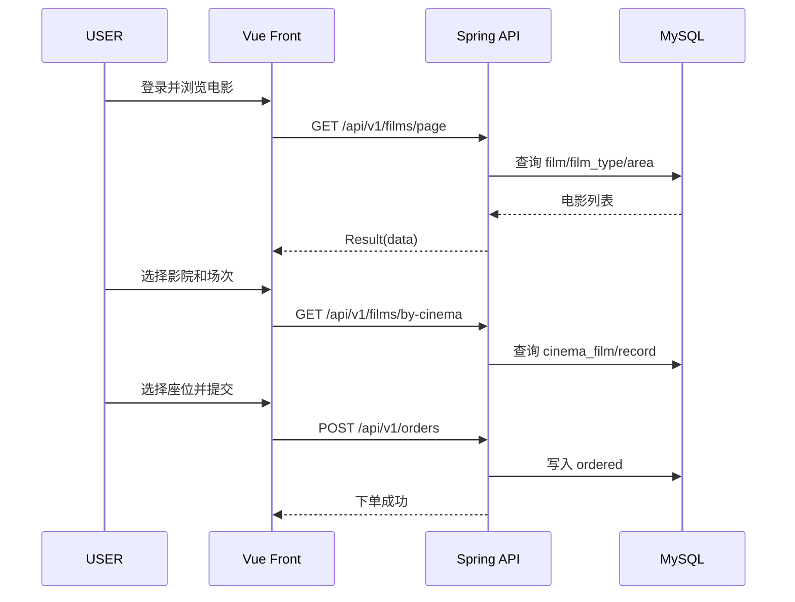
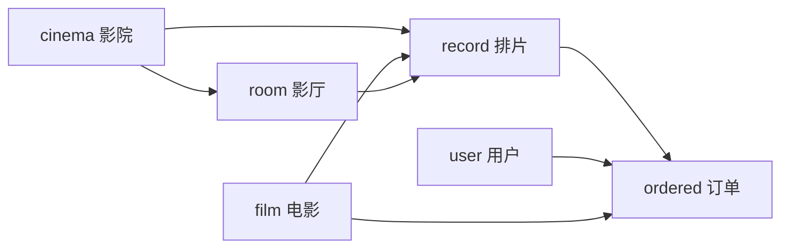

# 系统设计说明书

## 1. 系统概述

影院购票管理系统是一个基于 Spring Boot 3.3、Vue 3、MySQL 8.0 的 Web 应用，面向普通用户、影院管理员和系统管理员三类角色，提供电影浏览、影院排片、在线选座、订单管理、评价管理和后台运营能力。

本系统采用前后端分离架构：

- 前端：Vue 3 + Vite + Element Plus。
- 后端：Spring Boot + MyBatis + PageHelper + JWT。
- 数据库：MySQL，使用外键和索引约束核心业务链路。
- 文件存储：本地文件目录，通过 `/files/**` 暴露访问。

## 2. 设计目标

| 目标 | 说明 |
|------|------|
| 三端分离 | 用户端、影院端、管理端拥有独立路由和权限边界 |
| 购票闭环 | 支持电影浏览、选择影院、选择场次、选座、下单、订单查看 |
| 后台运营 | 支持影院、电影、分类、地区、演员、预告、公告、评价、订单管理 |
| 数据一致 | 电影、影院、影厅、排片、订单之间使用 ID 和外键关联 |
| 易维护 | 后端使用 BaseController/BaseService/BaseMapper 抽象通用 CRUD |
| 可验证 | 支持 Maven 编译、前端构建、数据库初始化、Playwright E2E |

## 3. 总体架构

## 4. 技术架构设计

### 4.1 前端技术架构

| 层级 | 组成 | 职责 |
|------|------|------|
| 路由层 | `router/index.js` | 定义三端路由，按角色控制访问 |
| 页面层 | `views/front`、`views/back`、`views/manage` | 用户端、影院端、管理端页面 |
| 请求层 | `utils/request.js` | Axios 实例、token 注入、统一错误处理 |
| 状态工具 | `utils/authStorage.js`、`composables/useAuth.js` | 登录态存储、角色判断、登录登出 |
| 常量层 | `constants/index.js` | API 路径、状态映射、上传地址 |
| 复用逻辑 | `composables/useCrud.js`、`useFormDialog.js` | 通用 CRUD 和表单弹窗逻辑 |

### 4.2 后端技术架构

| 层级 | 组成 | 职责 |
|------|------|------|
| Controller | `controller/*Controller.java` | 接收 HTTP 请求，调用 Service，返回统一 Result |
| Service | `service/*Service.java` | 业务逻辑、事务边界、复杂查询封装 |
| Mapper | `mapper/*Mapper.java` + XML | MyBatis SQL 映射 |
| Common | `BaseController`、`BaseService`、`BaseMapper` | 抽象通用 CRUD |
| Security | `JwtUtils`、`AuthInterceptor`、`RoleEnum` | JWT 认证和角色授权 |
| File | `FileUploadController`、`FileUtil` | 文件上传、MIME 白名单、URL 返回 |
| Exception | `GlobalExceptionHandler`、`CustomException` | 统一异常响应 |

## 5. 分层设计

### 5.1 后端三层 CRUD 抽象

设计说明：

- 标准资源使用统一 RESTful 端点，减少重复 Controller 代码。
- Service 默认只读事务，新增/更新/删除使用写事务。
- 复杂业务通过具体 Service/Mapper 扩展，例如电影排行榜、按影院查电影、影院分页筛选。

### 5.2 前端三端分层

## 6. 功能模块设计

| 模块 | 前端页面 | 后端资源 | 数据表 |
|------|----------|----------|--------|
| 认证与账号 | Login/Register/Password | `/api/v1/auth` | admin/user/cinema |
| 用户管理 | manage/user | `/api/v1/users` | user |
| 影院管理 | manage/cinema/back/person | `/api/v1/cinemas` | cinema |
| 电影管理 | front/movie/manage/film/back/film | `/api/v1/films` | film/film_type |
| 分类地区 | manage/type/manage/area | `/api/v1/types`、`/api/v1/areas` | type/area |
| 演员预告 | manage/actor/manage/video | `/api/v1/actors`、`/api/v1/videos` | actor/video |
| 影厅管理 | back/room/manage/room | `/api/v1/rooms` | room |
| 排片管理 | back/record/manage/record | `/api/v1/records` | record |
| 购票订单 | front/buyTicket/front/orders/back/ordered/manage/ordered | `/api/v1/orders` | ordered |
| 评价评分 | front/filmDetail/manage/mark | `/api/v1/marks` | mark |
| 公告管理 | manage/notice | `/api/v1/notices` | notice |
| 文件上传 | 多个上传控件 | `/api/v1/files/upload` | 本地文件目录 |

## 7. 核心业务设计

### 7.1 用户购票链路

### 7.2 影院排片链路

- 影院管理员维护影厅 `room`。
- 影院管理员选择可放映电影。
- 影院管理员创建排片 `record`，关联 `cinema_id`、`room_id`、`film_id`。
- 用户购票后生成订单 `ordered`，关联 `record_id`、`film_id`、`cinema_id`、`room_id`。

### 7.3 管理端运营链路

- 管理员维护基础数据：类型、地区、电影、演员、预告片。
- 管理员审核影院。
- 管理员发布公告。
- 管理员查看订单和评价。

## 8. 权限设计

| 层级 | 机制 | 说明 |
|------|------|------|
| 前端路由 | Vue Router meta roles | USER/CINEMA/ADMIN 只能进入对应端 |
| 请求认证 | Authorization Bearer Token | Axios 自动注入 JWT |
| 后端认证 | AuthInterceptor | 解析 JWT，写入 `userId`、`role` |
| 后端授权 | 路径前缀 + 方法类型 | 管理资源和写操作按角色限制 |
| 密码修改 | JWT 身份为准 | 不信任请求体中的 role |

## 9. 数据库设计概览

核心表分为四类：

- 账号表：`admin`、`user`、`cinema`
- 内容表：`film`、`type`、`area`、`actor`、`video`、`notice`
- 关联表：`film_type`、`cinema_film`
- 业务表：`room`、`record`、`ordered`、`mark`

主业务链路：

## 10. 接口设计概览

### 10.1 标准资源接口

标准资源遵循：

- `GET /api/v1/{resources}`
- `GET /api/v1/{resources}/{id}`
- `GET /api/v1/{resources}/page`
- `POST /api/v1/{resources}`
- `PUT /api/v1/{resources}`
- `DELETE /api/v1/{resources}/{id}`
- `DELETE /api/v1/{resources}/batch`

### 10.2 业务接口

- `/api/v1/auth/login`
- `/api/v1/auth/register`
- `/api/v1/auth/password`
- `/api/v1/auth/years`
- `/api/v1/films/search`
- `/api/v1/films/by-cinema`
- `/api/v1/films/box-office/top`
- `/api/v1/films/mark/top`
- `/api/v1/cinemas/page`
- `/api/v1/files/upload`

## 11. 部署设计概览

本地开发：

- 后端：`http://localhost:9090`
- 前端：`http://localhost:5173`
- 数据库：`localhost:3306/xm-film`
- 文件上传目录：默认 `D:/project/picture`

生产部署建议：

- 前端静态资源由 Nginx 托管。
- `/api/**` 反向代理到 Spring Boot。
- `/files/**` 反向代理到后端或迁移到对象存储。
- 数据库独立部署，密码、JWT 密钥、文件目录通过环境变量注入。

## 12. 设计约束

- 当前版本固定 8x8 座位图，不支持动态座位模板。
- 当前订单不包含真实支付、退款、改签。
- 当前视频表未通过外键强关联电影。
- 当前权限为角色级校验，对象级“影院只能操作本影院数据”建议作为下一阶段增强。

## 13. 设计验收标准

- 系统设计能映射到当前代码目录和数据库结构。
- 需求文档中的核心流程能在设计文档中找到对应模块。
- 数据库主链路支持电影、影院、影厅、排片、订单追踪。
- 权限设计覆盖前端路由和后端接口。
- 系统可通过编译、构建、数据库初始化和 E2E 验证。
