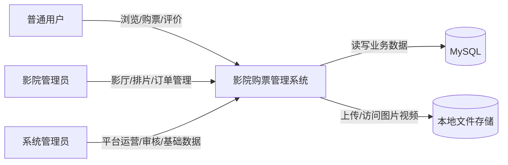
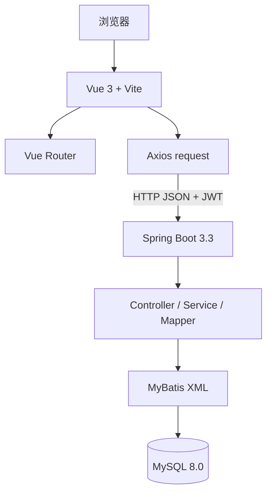
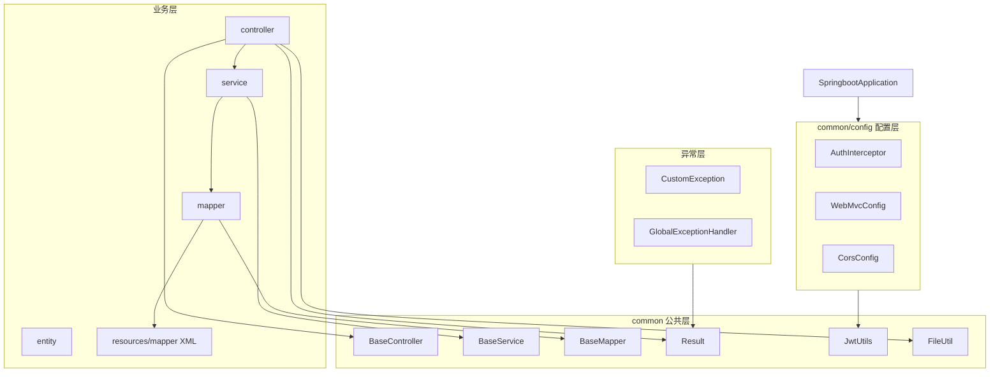
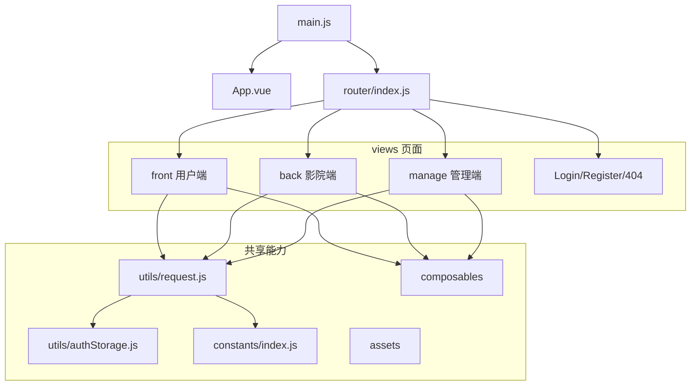
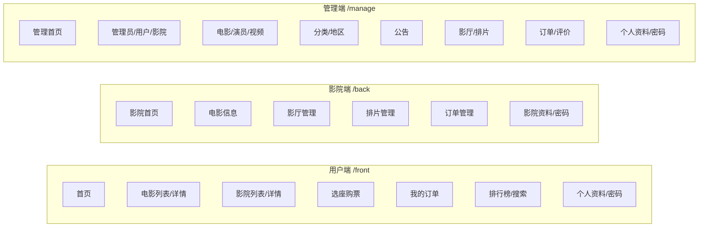
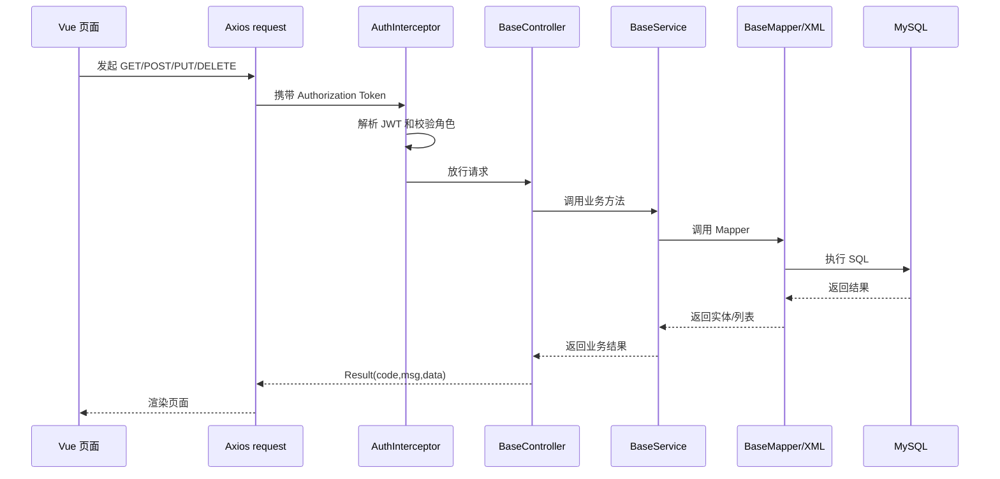
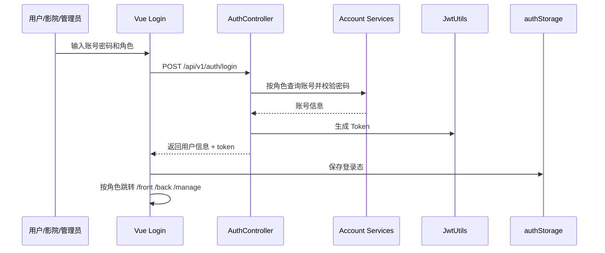
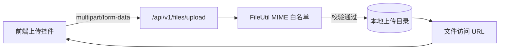

# 架构与模块设计图

本文档补充系统设计阶段常用的架构图和模块图，用于说明影院购票管理系统的静态结构、运行关系和核心调用链路。

## 1. 系统上下文图

## 2. 前后端分离架构图

## 3. 后端模块结构图

## 4. 前端模块结构图

## 5. 三端角色模块图

## 6. 标准 CRUD 调用链路

## 7. 登录认证调用链路

## 8. 文件上传链路

## 9. 设计图使用说明

- 答辩汇报优先使用：系统上下文图、前后端分离架构图、三端角色模块图。
- 技术评审优先使用：后端模块结构图、标准 CRUD 调用链路、登录认证调用链路。
- 安全说明优先使用：登录认证调用链路、文件上传链路。
