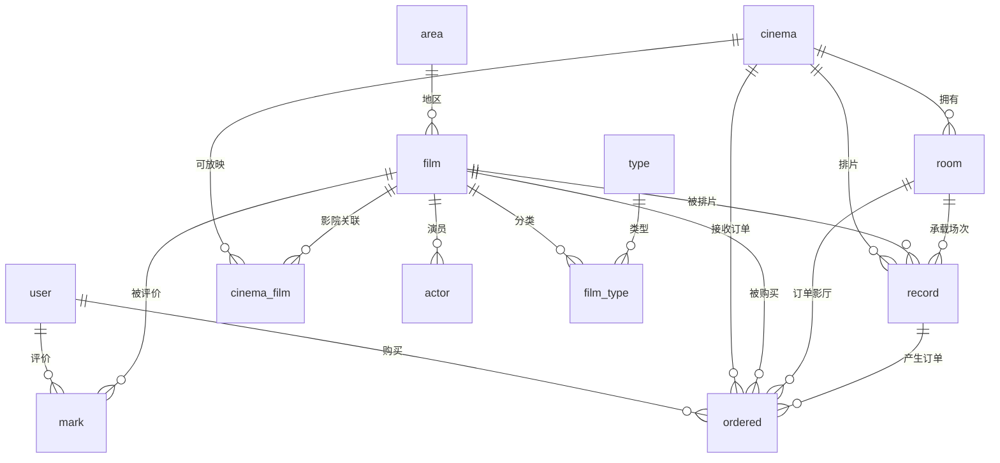
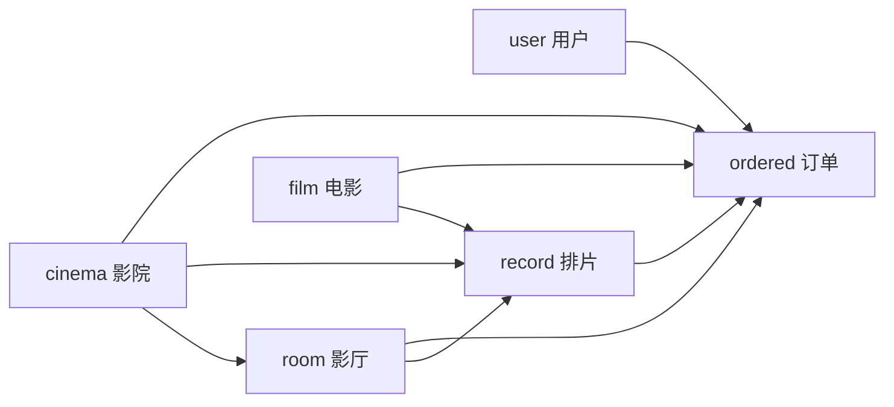

# 数据库设计说明

## 1. 数据库概述

数据库名：`xm-film`

数据库类型：MySQL 8.0

字符集建议：`utf8mb4`

初始化脚本：

- `xm_film/sql/schema.sql`
- `xm_film/sql/data.sql`
- `xm_film/sql/init.sql`
- 后端资源副本：`xm_film/springboot/src/main/resources/db`

## 2. 表分类

| 分类 | 表 |
|------|----|
| 账号表 | `admin`、`user`、`cinema` |
| 内容表 | `film`、`type`、`area`、`actor`、`video`、`notice` |
| 关联表 | `film_type`、`cinema_film` |
| 业务表 | `room`、`record`、`ordered`、`mark` |

## 3. 核心 ERD

## 4. 关键表设计

### 4.1 账号表

#### `admin`

系统管理员账号，负责平台全局后台。

关键字段：

- `id`
- `username`
- `password`
- `role`
- `name`
- `avatar`
- `phone`
- `email`

#### `user`

普通用户账号，负责前台购票。

关键字段：

- `id`
- `username`
- `password`
- `name`
- `role`
- `avatar`
- `phone`
- `email`

#### `cinema`

影院账号，负责影院端运营。

关键字段：

- `id`
- `username`
- `password`
- `role`
- `name`
- `phone`
- `email`
- `address`
- `leader`
- `code`
- `status`
- `certificate`
- `description`

### 4.2 内容表

#### `film`

电影主表。

关键字段：

- `id`
- `title`
- `english`
- `start`
- `time`
- `language`
- `resolution`
- `content`
- `img`
- `employee`
- `area_id`
- `status`
- `score`
- `box_office`
- `video`

索引：

- `idx_area_id`
- `idx_status`
- `idx_start`
- `FULLTEXT idx_title`

#### `actor`

演员表，通过 `film_id` 关联电影。

#### `type` / `area`

电影类型和地区字典表。

#### `video`

预告片内容表。当前未通过外键强关联 `film`，通过标题和资源 URL 与展示侧关联。

#### `notice`

平台公告表，包含标题、内容和发布时间。

### 4.3 关联表

#### `film_type`

电影和类型多对多关系。

主键：

- `(film_id, type_id)`

#### `cinema_film`

影院和电影多对多关系，表示影院可放映哪些电影。

约束：

- `UNIQUE KEY uk_cinema_film (cinema_id, film_id)`
- 外键关联 `cinema` 和 `film`

### 4.4 业务表

#### `room`

影厅表。

关键字段：

- `id`
- `cinema_id`
- `title`
- `name`

说明：

- `cinema_id` 关联影院。
- `title` 保留影院名称展示字段，兼容旧前端展示。

#### `record`

排片/场次表。

关键字段：

- `id`
- `cinema_id`
- `room_id`
- `film_id`
- `title`
- `start`
- `price`
- `status`

说明：

- `cinema_id`、`room_id`、`film_id` 构成排片主关联。
- `title` 保留电影名称展示字段，兼容旧前端展示。

#### `ordered`

订单表。

关键字段：

- `id`
- `orders`
- `record_id`
- `user_id`
- `film_id`
- `cinema_id`
- `room_id`
- `appointment`
- `total`
- `number`
- `status`
- `start`
- `seat`

约束：

- `UNIQUE KEY uk_ordered_orders (orders)`
- 外键关联 `record`、`user`、`film`、`cinema`、`room`

#### `mark`

评价/评分表。

关键字段：

- `id`
- `user_id`
- `film_id`
- `img`
- `mark`

## 5. 数据一致性设计

### 5.1 主业务链路

### 5.2 外键策略

| 表 | 外键 | 删除策略 |
|----|------|----------|
| `cinema_film` | `cinema_id`、`film_id` | CASCADE |
| `room` | `cinema_id` | SET NULL |
| `record` | `cinema_id`、`room_id` | CASCADE |
| `record` | `film_id` | SET NULL |
| `ordered` | `record_id` | SET NULL |
| `ordered` | `user_id`、`film_id`、`cinema_id`、`room_id` | CASCADE |
| `mark` | `user_id`、`film_id` | CASCADE |

## 6. 初始化数据设计

初始化数据包含：

- 默认管理员账号。
- 默认普通用户账号。
- 默认影院账号。
- 电影类型和地区。
- 电影、演员、影院、影厅、排片、订单和评价样例。

数据要求：

- 排片中的 `cinema_id` 与 `room.cinema_id` 语义一致。
- 订单中的 `record_id`、`film_id`、`cinema_id`、`room_id` 能追踪到同一购票链路。
- `cinema_film` 覆盖初始化排片中出现的影院和电影组合。

## 7. 数据库设计约束

- 当前座位未拆成独立座位表，订单座位以字符串存储。
- 当前订单不包含真实支付状态。
- 当前 `video` 未通过外键强关联电影。
- 当前 `room` 未存储动态座位模板。

这些约束已在 PRD 路线图中作为后续优化方向。
