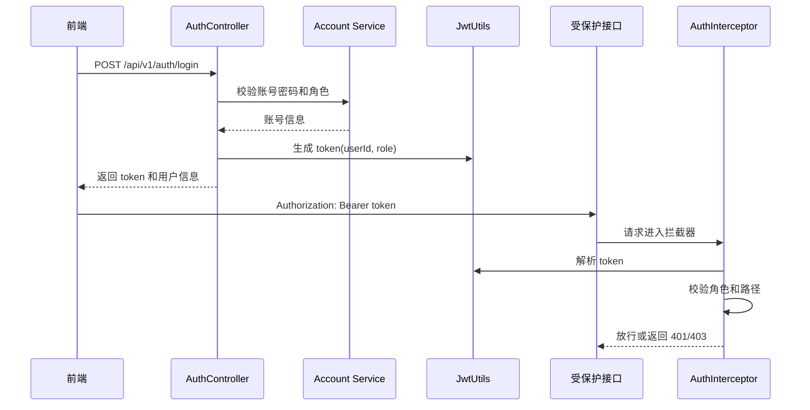

# 接口与安全设计

## 1. 接口设计原则

- 使用 RESTful 风格，统一前缀为 `/api/v1`。
- 标准资源采用复用 CRUD 端点。
- 业务查询采用语义化路径，例如 `/films/box-office/top`。
- 响应结构统一使用 `Result`，包含 `code`、`msg`、`data`。
- 登录后通过 JWT Token 认证。

## 2. API 分组

### 2.1 认证接口

| 方法 | 路径 | 说明 | 认证 |
|------|------|------|------|
| POST | `/api/v1/auth/login` | 登录 | 否 |
| POST | `/api/v1/auth/register` | 注册 | 否 |
| PUT | `/api/v1/auth/password` | 修改密码 | 是 |
| GET | `/api/v1/auth/years` | 查询年份列表 | 否 |

### 2.2 标准资源接口

适用资源：

`admins`、`users`、`cinemas`、`films`、`actors`、`areas`、`types`、`notices`、`rooms`、`records`、`orders`、`marks`、`videos`

| 方法 | 路径 | 说明 |
|------|------|------|
| GET | `/api/v1/{resources}` | 查询列表 |
| GET | `/api/v1/{resources}/{id}` | 按 ID 查询 |
| GET | `/api/v1/{resources}/page` | 分页查询 |
| POST | `/api/v1/{resources}` | 新增 |
| PUT | `/api/v1/{resources}` | 更新 |
| DELETE | `/api/v1/{resources}/{id}` | 删除 |
| DELETE | `/api/v1/{resources}/batch` | 批量删除 |

### 2.3 业务接口

| 方法 | 路径 | 说明 |
|------|------|------|
| GET | `/api/v1/films/search` | 按标题搜索电影 |
| GET | `/api/v1/films/by-cinema` | 按影院查询电影 |
| GET | `/api/v1/films/box-office/top` | 票房排行榜 |
| GET | `/api/v1/films/mark/top` | 评分排行榜 |
| GET | `/api/v1/cinemas/page` | 影院分页，支持按电影筛选 |
| POST | `/api/v1/files/upload` | 上传图片/视频 |

## 3. 响应格式设计

示例：

```json
{
  "code": "200",
  "msg": "请求成功",
  "data": {}
}
```

常见状态：

| code | 含义 |
|------|------|
| 200 | 成功 |
| 401 | 未登录或 token 过期 |
| 403 | 权限不足 |
| 500 | 业务异常或系统异常 |

## 4. 认证设计



## 5. 授权设计

### 5.1 前端授权

前端路由使用 `meta.requiresAuth` 和 `meta.roles`：

- `/front/*`：USER
- `/back/*`：CINEMA
- `/manage/*`：ADMIN

前端守卫只负责用户体验层面的跳转控制，不能替代后端安全校验。

### 5.2 后端授权

后端 `AuthInterceptor`：

- 解析 Authorization Bearer Token。
- 将 `userId` 和 `role` 写入 request attribute。
- ADMIN 默认拥有全部权限。
- 非管理员不能访问管理员专属资源。
- 非管理员不能写入受保护的电影资源。

当前管理员专属资源：

- `/api/v1/admins`
- `/api/v1/actors`
- `/api/v1/areas`
- `/api/v1/types`
- `/api/v1/notices`
- `/api/v1/videos`

当前管理员写保护资源：

- `/api/v1/films`

## 6. 密码修改安全设计

密码修改接口：

`PUT /api/v1/auth/password`

安全规则：

- 用户 ID 从 JWT subject 中读取。
- 角色从 JWT claims 中读取。
- 不信任请求体中的 `role`。
- 根据 JWT 角色分发到对应 Service 更新密码。

## 7. 文件上传安全设计

文件上传接口：

`POST /api/v1/files/upload`

安全措施：

- 限制上传大小：50MB。
- 使用 MIME 白名单校验文件类型。
- 文件存储到配置目录。
- 返回可访问 URL。
- 文件访问通过 `/files/**` 资源映射。

设计约束：

- 当前为本地文件存储。
- 生产环境建议迁移到对象存储，如 OSS/S3。
- 上传目录通过 `FILE_UPLOAD_DIR` 环境变量配置。

## 8. 跨域设计

系统包含 CORS 配置，支持前端 Vite 开发服务器访问后端 API。

本地默认：

- 前端：`http://localhost:5173`
- 后端：`http://localhost:9090`

## 9. 接口调用约定

前端统一通过 `utils/request.js` 调用接口：

- 自动设置 `Content-Type: application/json;charset=utf-8`。
- 自动从 `authStorage` 读取 token。
- 自动注入 `Authorization` 请求头。
- 统一处理 401、403、404、500 错误提示。

## 10. 接口设计风险

| 风险 | 当前状态 | 后续建议 |
|------|----------|----------|
| 对象级权限不足 | 当前主要为角色级权限 | 增加影院只能操作本影院数据的校验 |
| 文件本地存储 | 已实现 | 生产迁移 OSS/S3 |
| 订单并发锁座 | 未实现 | 增加座位锁定表和过期释放 |
| 支付回调安全 | 未实现 | 接入支付后增加签名验签和幂等处理 |
