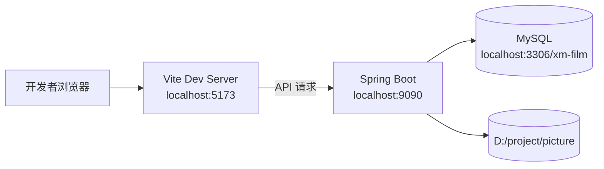
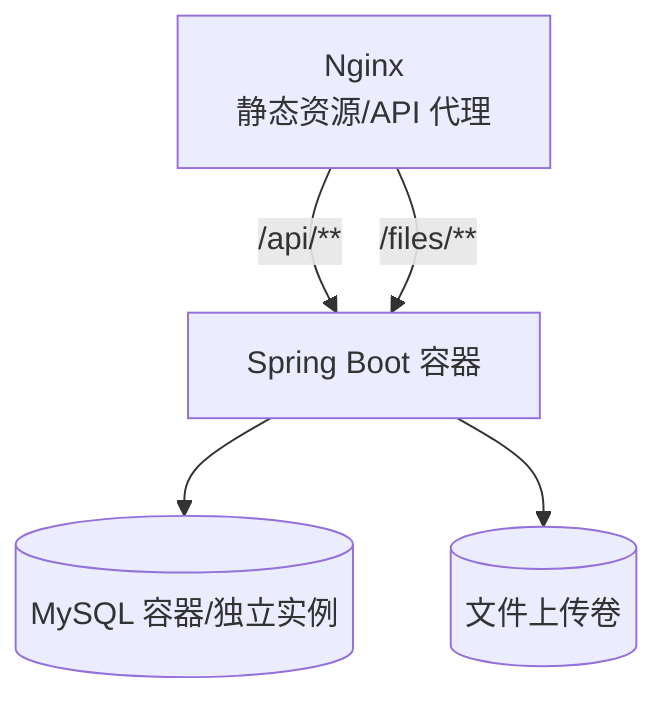

# 部署与运行设计

## 1. 部署目标

部署设计用于说明系统在本地开发、CI 验证和生产环境中的运行方式，确保前端、后端、数据库和文件存储能稳定协同。

## 2. 本地开发拓扑



启动顺序：

1. 初始化 MySQL 数据库。
2. 启动 Spring Boot 后端。
3. 启动 Vue/Vite 前端。
4. 运行 E2E 或手动访问页面。

## 3. 本地运行命令

### 3.1 数据库初始化

```bash
cd xm_film/sql
mysql --default-character-set=utf8mb4 -u root -p < init.sql
```

### 3.2 后端启动

```bash
cd xm_film/springboot
mvn clean package -DskipTests
java -jar target/springboot-0.0.1-SNAPSHOT.jar
```

### 3.3 前端启动

```bash
cd xm_film/vue
npm install
npm run dev
```

### 3.4 E2E 验证

```bash
cd xm_film/vue
node e2e-tests/e2e-scan.spec.mjs
```

## 4. 环境变量设计

| 变量 | 默认值 | 说明 |
|------|--------|------|
| `DB_HOST` | `localhost` | MySQL 主机 |
| `DB_USERNAME` | `root` | 数据库用户名 |
| `DB_PASSWORD` | `123456` | 数据库密码 |
| `JWT_SECRET` | 内置开发密钥 | JWT 签名密钥 |
| `JWT_EXPIRE` | `86400000` | JWT 过期时间，毫秒 |
| `FILE_UPLOAD_DIR` | `D:/project/picture` | 文件上传目录 |
| `MYBATIS_LOG_IMPL` | `Slf4jImpl` | MyBatis 日志实现 |
| `MYBATIS_LOG_LEVEL` | `DEBUG` | Mapper 日志级别 |
| `VITE_API_BASE_URL` | `http://localhost:9090` | 前端 API 基础地址 |

生产环境必须覆盖：

- `DB_PASSWORD`
- `JWT_SECRET`
- `FILE_UPLOAD_DIR`

## 5. CI 运行设计

CI 目标：

- 后端编译。
- 前端构建。
- MySQL 初始化。
- 后端启动。
- 前端启动。
- Playwright E2E 全量验证。

CI 专属配置：

- `application-ci.yml`
- 数据库连接默认 `127.0.0.1:3306/xm-film`
- JWT 使用 CI 测试密钥。
- 文件上传目录使用临时目录。

## 6. Docker 部署设计

项目根目录包含：

- `Dockerfile`
- `docker-compose.yml`

建议部署拓扑：



## 7. 生产部署建议

### 7.1 前端

- 执行 `npm run build`。
- 将 `dist/` 部署到 Nginx。
- 配置 history fallback 到 `index.html`。

### 7.2 后端

- 执行 `mvn clean package -DskipTests`。
- 使用 `java -jar` 或容器运行 jar。
- 通过环境变量注入数据库、JWT 和文件目录配置。

### 7.3 数据库

- 独立部署 MySQL 8.0。
- 开启定期备份。
- 生产环境禁用自动重建表脚本。
- 使用强密码和最小权限账号。

### 7.4 文件

- 当前本地文件存储适合开发和演示。
- 生产建议迁移 OSS/S3。
- 如果继续使用本地存储，需要配置持久化磁盘和备份策略。

## 8. Nginx 反向代理示例

```nginx
server {
    listen 80;
    server_name your-domain.com;

    root /path/to/vue/dist;
    index index.html;

    location / {
        try_files $uri $uri/ /index.html;
    }

    location /api/ {
        proxy_pass http://127.0.0.1:9090;
        proxy_set_header Host $host;
        proxy_set_header X-Real-IP $remote_addr;
    }

    location /files/ {
        proxy_pass http://127.0.0.1:9090;
    }
}
```

## 9. 运行健康检查

可用于判断服务是否启动：

- 后端：`GET http://localhost:9090/api/v1/auth/years`
- 前端：`GET http://localhost:5173`
- 数据库：执行 `mysql` 连接并查询基础表。

## 10. 部署风险与应对

| 风险 | 影响 | 应对 |
|------|------|------|
| 数据库密码泄露 | 数据安全风险 | 使用环境变量和最小权限账号 |
| JWT 密钥过短或泄露 | 账号安全风险 | 生产环境配置高强度随机密钥 |
| 上传目录丢失 | 图片/视频无法访问 | 使用持久化卷或对象存储 |
| 前端 history 路由 404 | 刷新页面失败 | Nginx 配置 `try_files` |
| MySQL 字符集不一致 | 中文乱码 | 使用 `utf8mb4` 和 `--default-character-set=utf8mb4` |
| Playwright 在 Windows 受限 | E2E 启动浏览器失败 | 使用允许启动浏览器的 CI/本地权限环境 |
