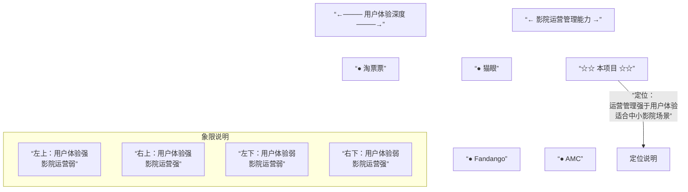

# 竞品分析

## 1. 分析目标

本分析用于回答：当前影院购票管理系统相对成熟票务平台处于什么位置，已覆盖哪些核心链路，缺少哪些商业化能力，以及后续 PRD 应优先优化什么。

本项目是教学型/中小型影院票务管理系统，竞品并非完全同量级。因此分析采用“能力对标”而不是“商业规模对标”。

## 2. 竞品选择

| 产品 | 类型 | 选择原因 |
|------|------|----------|
| 猫眼电影 | 国内综合票务平台 | 覆盖影片资讯、影院排片、在线选座、评分票房和娱乐内容 |
| 淘票票 | 国内综合票务平台 | 强支付生态、优惠活动、影院覆盖和影评资讯 |
| Fandango | 海外电影票务平台 | 在线选座、影院偏好、移动票、奖励体系成熟 |
| AMC Theatres App | 影院自营 App | 代表影院侧自营票务、会员和影厅服务能力 |

## 3. 竞品功能观察

### 3.1 猫眼电影

公开资料显示，猫眼类产品核心覆盖在线选座购票、影院排片、影片信息、口碑评分、票房和排行榜等观影决策能力。其优势是内容和交易链路结合较深，用户既可以看资讯，也可以完成购票。

对本项目启发：

- 本项目已有电影详情、影院排片、排行榜、在线选座和订单闭环。
- 可继续补强“用户决策信息”，例如更清晰的评分、热门标签、影院距离、影片热度趋势。
- 可补充内容运营能力，例如公告、预告、影片推荐位。

### 3.2 淘票票

公开资料显示，淘票票强调在线选座、多支付方式、优惠活动、会员权益和影片资讯。它背靠支付和生活服务生态，用户在购票时对优惠、支付便利、售后能力的预期更强。

对本项目启发：

- 本项目当前没有真实支付和优惠券，适合作为二期能力。
- 当前订单状态只有待取票、已取票、已取消，后续可扩展待支付、已支付、退款中、已退款。
- 可新增营销能力：优惠券、满减、影院活动、会员折扣。

### 3.3 Fandango

Fandango App Store 页面介绍其支持座位图预览、保存常用影院、支付信息、影院奖励账号，并在购票中结合奖励体系。Fandango Quick Facts 也强调其电影票网络覆盖和移动票能力。

对本项目启发：

- 本项目固定 8x8 座位图可以满足基础演示，但离真实影院座位图仍有差距。
- 可优化为影厅维度座位模板，支持不可售座、过道、情侣座、不同票价区。
- 可补充“常用影院”和“移动取票码”。

### 3.4 AMC Theatres App

AMC App 公开说明强调影院自有账号、会员卡、数字票、影院服务和会员权益。AMC 也曾测试过按座位位置差异定价，说明影院自营场景会关注票价策略和座位收益。

对本项目启发：

- 影院端不应只是排片后台，还可以管理座位、票价策略、订单核销和营销活动。
- 可在二期增加影院自营运营台：今日场次、待取票订单、影厅上座率、场次收入。

## 4. 功能对比矩阵

| 能力 | 当前项目 | 猫眼/淘票票 | Fandango | AMC |
|------|----------|-------------|----------|-----|
| 三端角色分离 | 强 | 平台端不公开 | 平台侧为主 | 影院自营侧强 |
| 影片浏览 | 已有 | 强 | 强 | 强 |
| 影院列表 | 已有 | 强 | 强 | 强 |
| 排片查询 | 已有 | 强 | 强 | 强 |
| 在线选座 | 已有基础 8x8 | 强 | 强 | 强 |
| 下单 | 已有 | 强 | 强 | 强 |
| 支付 | 未实现 | 强 | 强 | 强 |
| 退票/改签 | 未实现 | 强 | 部分支持 | 依影院规则 |
| 评分评价 | 已有基础 | 强 | 中 | 中 |
| 排行榜 | 已有 | 强 | 中 | 弱 |
| 影院后台 | 已有 | 不面向普通用户 | 弱 | 强 |
| 平台后台 | 已有 | 内部能力 | 内部能力 | 内部能力 |
| 会员/积分 | 未实现 | 强 | 强 | 强 |
| 优惠券/活动 | 未实现 | 强 | 中 | 强 |
| 移动票/取票码 | 未实现 | 强 | 强 | 强 |
| 座位模板 | 固定座位图 | 强 | 强 | 强 |
| 数据看板 | 部分首页统计 | 强 | 内部能力 | 强 |

> 术语说明：角色定义见[术语表 §1](./glossary.md#1-角色与权限)，业务实体定义见[术语表 §2](./glossary.md#2-核心业务实体)，订单状态定义详见 [PRD §8.1](./03-product-requirements-document.md#81-订单状态定义)。

## 5. 当前项目优势

- 三端角色清晰，适合展示完整管理系统架构。
- 后端已经具备 RESTful API、JWT、RBAC、Base CRUD 和数据库外键约束。
- 功能闭环完整：电影管理、影院管理、排片、选座、订单、评价。
- E2E 自动化覆盖较完整，便于持续验证。
- 适合进一步包装为“影院票务 SaaS 后台 + 用户购票前台”的产品雏形。

## 6. 当前项目短板

- 缺少真实支付、退款、改签。
- 选座模型固定，无法表达真实影厅座位结构。
- 订单缺少支付状态、取票码和核销流程。
- 影院端数据看板不足，缺少经营分析。
- 用户侧个性化较弱，缺少收藏、常用影院、推荐和营销。
- 评价系统较基础，未区分评分、评论内容、审核状态。

## 7. 差异化定位建议

短期不要试图复制大型票务平台的所有用户增长能力，而应强化”中小影院运营管理 + 在线购票闭环”：

- 对用户：简单、清晰、快速购票。
- 对影院：轻量排片、订单管理、影厅维护。
- 对管理员：平台数据治理、影院审核、运营配置。

这样更符合当前系统体量，也更容易在课程设计、毕业设计或企业内部工具场景中讲清楚价值。

### 7.1 竞品四象限定位图

以 **用户体验深度**（横轴）和 **影院运营管理能力**（纵轴）两个维度定位各产品：

> **解读：** 猫眼/淘票票侧重用户侧体验（资讯+购票），Fandango/AMC 兼顾两侧，本项目当前在影院运营管理侧有一定深度，但用户体验侧（支付、推荐、会员）有提升空间。路线图规划详见 [PRD 优化路线图 §6](./04-prd-optimization-roadmap.md#6-推荐版本规划)。

## 8. 资料来源

- Fandango App Store 页面，座位图预览、偏好影院、奖励账号等功能说明：https://apps.apple.com/us/app/fandango-get-movie-tickets/id307906541
- Fandango Quick Facts，票务网络和移动票信息：https://images.fandango.com/pdf/QuickFacts.pdf
- AMC Theatres Mobile App Help，会员账号、数字卡和移动端服务说明：https://www.amctheatres.com/mobile/help
- AMC Theatres App Store 页面，影院查找、会员卡、手机票等功能说明：https://apps.apple.com/us/app/amc-theatres-movies-more/id509199715
- 豆瓣电影票说明，在线选座购票和影院覆盖信息：https://movie.douban.com/ticket/guide
- 淘票票公开介绍，在线选座、影院覆盖等信息：https://zh.wikipedia.org/wiki/%E6%B7%98%E7%A5%A8%E7%A5%A8

说明：国内猫眼、淘票票具体功能会随版本变化，本文只引用公开可见能力作为产品对标，不作为商业数据结论。
