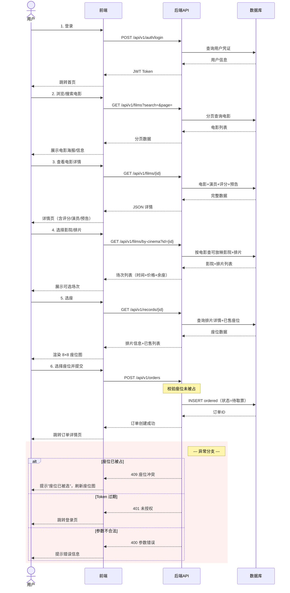
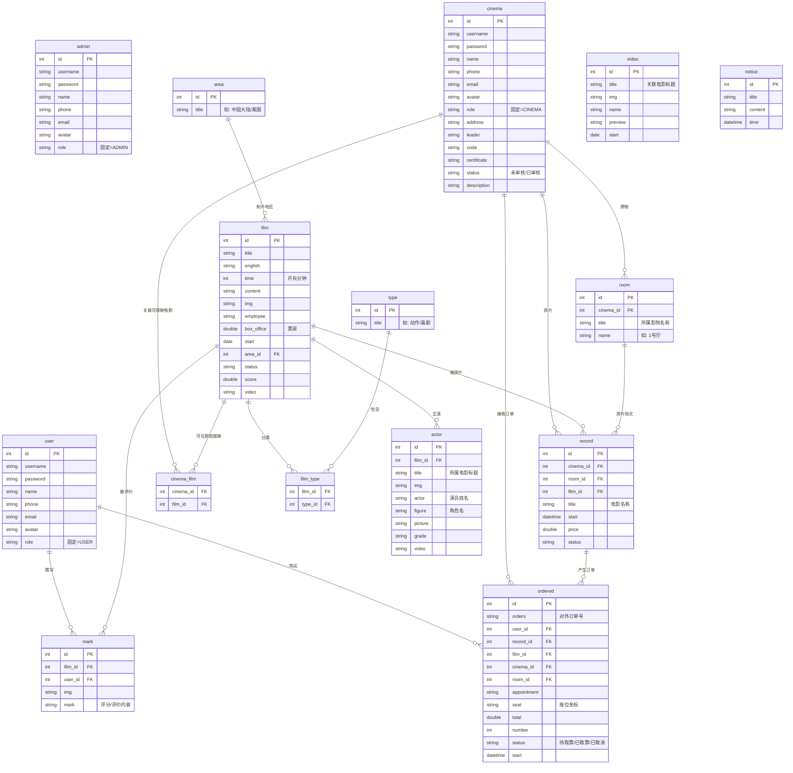

# 产品需求文档 PRD

## 1. 文档信息

| 项目 | 内容 |
|------|------|
| 产品名称 | 影院购票管理系统 |
| 产品类型 | Web 在线购票 + 影院后台 + 管理后台 |
| 当前版本 | V1.0 |
| 技术实现 | Spring Boot 3.3 + Vue 3 + MySQL |
| 目标用户 | 普通观影用户、影院管理员、系统管理员 |
| 文档状态 | 基于当前代码和数据库补齐 |

## 2. 产品概述

影院购票管理系统是一个支持三端角色分离的在线电影购票平台。用户可以浏览影片、查看影院和场次、在线选座并生成订单；影院管理员可以维护影院、影厅、排片和订单；系统管理员可以维护平台基础数据、审核影院并管理全局运营内容。

## 3. 产品目标

### 3.1 业务目标

- 建立从电影上架、影院排片、用户选座到订单管理的闭环。
- 提升影院排片和订单管理效率。
- 为用户提供可在线完成的购票体验。
- 为平台管理员提供统一的数据治理和运营后台。

### 3.2 产品目标

- 三端权限清晰，不同角色进入不同工作台。
- 核心购票流程可完成：选电影/影院/场次/座位/下单。
- 后台数据可维护，支持分页、搜索、增删改查。
- 系统可通过自动化测试验证主流程。

## 4. 角色与权限

| 角色 | 入口 | 权限 |
|------|------|------|
| USER | `/front/*` | 浏览、搜索、购票、查看订单、维护资料、评价 |
| CINEMA | `/back/*` | 影院资料、影厅、排片、订单管理 |
| ADMIN | `/manage/*` | 平台全局数据管理、影院审核、电影、订单、评价、公告等管理 |

> 术语说明：角色定义详见[术语表 §1](./glossary.md#1-角色与权限)，业务实体定义详见[术语表 §2](./glossary.md#2-核心业务实体)。

权限规则：

- 路由层通过前端守卫拦截非授权访问。
- 接口层通过 JWT 和后端拦截器校验登录状态与角色。
- 修改密码以 JWT 身份为准，避免前端伪造角色。

## 5. 产品范围

### 5.1 V1.0 范围内

- 用户注册、登录、修改密码。
- 影院注册和审核。
- 电影、分类、地区、演员、视频、公告管理。
- 影院、影厅、排片管理。
- 用户端电影浏览、影院浏览、搜索、排行榜。
- 在线选座和订单生成。
- 订单查询和状态管理。
- 影片评分评价。
- 文件上传。

### 5.2 V1.0 范围外

- 真实支付、退款、改签。
- 第三方短信、邮件通知。
- 地图定位和附近影院。
- 动态座位模板。
- 优惠券、会员积分。
- 高并发座位锁定。
- 真实验票码和核销设备对接。

## 6. 核心用户流程

> 详细用例图、业务流程图和数据流图见[建模图文档](./05-modeling-diagrams.md)。

### 6.1 用户购票流程

1. 用户登录。
2. 进入首页或电影列表。
3. 搜索或筛选电影。
4. 查看电影详情。
5. 选择影院和排片。
6. 进入选座页面。
7. 选择座位。
8. 提交订单。
9. 查看我的订单。

**用户购票交互流程（泳道图）：**

**验收标准：**

- 未登录用户访问购票相关页面会跳转登录。
- 用户只能进入用户端页面。
- 下单时订单记录包含用户、电影、影院、影厅、场次、座位、金额和状态。
- 已选座位在订单中可追踪。

### 6.2 影院排片流程

1. 影院管理员登录。
2. 维护影院资料。
3. 新增或编辑影厅。
4. 查看可排电影。
5. 创建排片，选择电影、影厅、时间、价格、状态。
6. 查看订单。

验收标准：

- 影院管理员只能访问影院后台。
- 排片记录需要关联影院、影厅、电影。
- 订单能在影院后台按影院或订单条件查看。

### 6.3 管理员运营流程

1. 管理员登录。
2. 维护基础数据：分类、地区、电影、演员、视频。
3. 审核影院。
4. 查看或维护影厅、排片、订单、评价。
5. 发布公告。

验收标准：

- 管理员可以访问管理后台 16 个页面。
- 非管理员不能访问管理端资源。
- 管理端 CRUD 操作支持分页、搜索、批量删除等基础能力。

## 7. 功能需求

### 7.1 认证模块

| 功能 | 描述 | 优先级 |
|------|------|--------|
| 登录 | 用户、影院、管理员三端共用登录入口 | P0 |
| 注册 | 支持用户和影院注册 | P0 |
| 修改密码 | 登录后修改密码 | P0 |
| 登录态存储 | 前端统一存储 token 和用户信息 | P0 |
| 路由守卫 | 按角色限制页面访问 | P0 |

### 7.2 用户前台

| 功能 | 描述 | 优先级 |
|------|------|--------|
| 首页 | 展示电影、影院、排行榜入口 | P0 |
| 电影列表 | 展示电影，可分页或搜索 | P0 |
| 电影详情 | 展示影片基础信息、演员、评分、预告 | P0 |
| 影院列表 | 展示影院列表 | P0 |
| 影院详情 | 展示影院信息和可选排片 | P0 |
| 选择影院 | 从电影进入可放映影院列表 | P0 |
| 购票选座 | 固定 8x8 座位图选座下单 | P0 |
| 我的订单 | 查看用户订单 | P0 |
| 排行榜 | 查看票房榜和评分榜 | P1 |
| 搜索 | 按电影名称搜索 | P1 |
| 个人资料 | 修改个人资料 | P1 |

### 7.3 影院后台

| 功能 | 描述 | 优先级 |
|------|------|--------|
| 首页 | 影院后台入口 | P0 |
| 电影信息 | 查看可排电影 | P0 |
| 影厅管理 | 管理影厅 | P0 |
| 排片管理 | 管理场次、价格、状态 | P0 |
| 订单管理 | 查看影院订单 | P0 |
| 个人资料 | 维护影院资料 | P1 |
| 修改密码 | 修改影院账号密码 | P1 |

### 7.4 管理后台

| 功能 | 描述 | 优先级 |
|------|------|--------|
| 首页 | 平台管理入口和概览 | P0 |
| 管理员管理 | 管理平台管理员账号 | P0 |
| 用户管理 | 管理普通用户 | P0 |
| 影院管理 | 审核和维护影院 | P0 |
| 分类管理 | 管理电影类型 | P0 |
| 地区管理 | 管理电影地区 | P0 |
| 电影管理 | 管理影片基础信息 | P0 |
| 演员管理 | 管理演员和电影关联 | P1 |
| 公告管理 | 发布平台公告 | P1 |
| 影厅管理 | 查看和管理影厅 | P1 |
| 排片管理 | 查看和管理排片 | P0 |
| 订单管理 | 查看和管理订单 | P0 |
| 评价管理 | 查看和管理评价 | P1 |
| 视频管理 | 管理预告片 | P1 |
| 个人资料 | 修改管理员资料 | P1 |
| 修改密码 | 修改管理员密码 | P1 |

## 8. 数据需求

核心实体：

- 账号类：`admin`、`user`、`cinema`
- 内容类：`film`、`type`、`area`、`actor`、`video`、`notice`
- 业务类：`cinema_film`、`room`、`record`、`ordered`、`mark`

关键关系：

- 一个电影可关联多个类型：`film_type`
- 一个影院可关联多个电影：`cinema_film`
- 一个影院拥有多个影厅：`room.cinema_id`
- 一个排片关联影院、影厅、电影：`record.cinema_id`、`record.room_id`、`record.film_id`
- 一个订单关联用户、场次、电影、影院、影厅：`ordered.user_id`、`ordered.record_id`、`ordered.film_id`、`ordered.cinema_id`、`ordered.room_id`

### 8.1 订单状态定义

V1.0 订单状态（字段 `ordered.status`）枚举值：

| 状态值 | 含义 | 触发条件 | 下一个可能状态 |
|--------|------|----------|---------------|
| `待取票` | 订单已生成，等待用户到影院取票 | 用户提交订单后默认进入 | 已取票、已取消 |
| `已取票` | 影院已核销，用户已完成取票 | 影院管理员在后台核销 | —（终态） |
| `已取消` | 订单被取消 | 用户主动取消 | —（终态） |

**业务规则：**
- 只有"待取票"状态的订单可以取消。
- 只有"待取票"状态的订单可以核销为"已取票"。
- 已取消的订单不可恢复。
- 已取票的订单不可取消。

> 扩展状态（待支付、已支付、退款中、已退款）规划见 [PRD 优化路线图 §3.1](./04-prd-optimization-roadmap.md#31-订单状态机)

### 8.2 实体关系图 (ERD)

以下是核心 14 张表之间的实体关系：

**关系说明：**
- `film` ↔ `type`：多对多，通过 `film_type` 中间表关联
- `cinema` ↔ `film`：多对多，通过 `cinema_film` 中间表关联
- `film` → `actor`：一对多，通过 `actor.film_id` 关联
- `video` 当前为内容管理表，未通过外键强关联 `film`，可通过标题/预告 URL 与影片展示侧弱关联
- `notice` 当前为公告内容表，未存储发布人外键
- 购票主路径：`film → record → ordered`，一条 record 可产生多个 ordered
- 影院资源路径：`cinema → room → record`，一个 cinema 可拥有多个 room

## 9. 接口需求

基础接口遵循 `/api/v1/{resources}` 风格：

- `GET /api/v1/{resources}` 查询全部
- `GET /api/v1/{resources}/{id}` 按 ID 查询
- `GET /api/v1/{resources}/page` 分页查询
- `POST /api/v1/{resources}` 新增
- `PUT /api/v1/{resources}` 更新
- `DELETE /api/v1/{resources}/{id}` 删除
- `DELETE /api/v1/{resources}/batch` 批量删除

认证接口：

- `POST /api/v1/auth/login`
- `POST /api/v1/auth/register`
- `PUT /api/v1/auth/password`
- `GET /api/v1/auth/years`

业务接口：

- `GET /api/v1/films/box-office/top`
- `GET /api/v1/films/mark/top`
- `GET /api/v1/films/search`
- `GET /api/v1/films/by-cinema`
- `GET /api/v1/cinemas/page`
- `POST /api/v1/files/upload`

## 10. 页面需求

### 10.1 用户端

| 页面 | 路径 | 说明 |
|------|------|------|
| 首页 | `/front/home` | 展示首页内容 |
| 电影列表 | `/front/movie` | 浏览电影 |
| 电影详情 | `/front/filmDetail/:id` | 查看电影详情 |
| 影院列表 | `/front/cinema` | 浏览影院 |
| 影院详情 | `/front/cinemaDetail/:id` | 查看影院详情 |
| 电影选影院 | `/front/filmCinema/:id` | 选择可放映影院 |
| 购票 | `/front/buyTicket` | 选座下单 |
| 我的订单 | `/front/orders` | 查看订单 |
| 排行榜 | `/front/rank` | 查看排行 |
| 搜索 | `/front/search` | 搜索结果 |
| 个人资料 | `/front/person` | 维护资料 |
| 修改密码 | `/front/password` | 修改密码 |

### 10.2 影院端

| 页面 | 路径 |
|------|------|
| 首页 | `/back/home` |
| 电影信息 | `/back/film` |
| 影厅管理 | `/back/room` |
| 排片管理 | `/back/record` |
| 订单管理 | `/back/ordered` |
| 个人资料 | `/back/person` |
| 修改密码 | `/back/password` |

### 10.3 管理端

| 页面 | 路径 |
|------|------|
| 首页 | `/manage/home` |
| 管理员 | `/manage/admin` |
| 用户 | `/manage/user` |
| 影院 | `/manage/cinema` |
| 分类 | `/manage/type` |
| 地区 | `/manage/area` |
| 电影 | `/manage/film` |
| 演员 | `/manage/actor` |
| 公告 | `/manage/notice` |
| 影厅 | `/manage/room` |
| 排片 | `/manage/record` |
| 订单 | `/manage/ordered` |
| 评价 | `/manage/mark` |
| 视频 | `/manage/video` |
| 个人资料 | `/manage/person` |
| 修改密码 | `/manage/password` |

## 11. 验收标准

### 11.1 功能验收

- 用户、影院、管理员均可使用默认账号登录。
- 登录后按角色跳转到对应端。
- 管理端 16 个页面可正常访问。
- 影院端 7 个页面可正常访问。
- 用户端核心页面可正常访问。
- 电影分类 CRUD 可完成新增、编辑、删除。
- 搜索、分页可正常工作。
- 无 token 访问受限接口返回未授权。
- 越权访问会被拦截。

### 11.2 技术验收

- 后端 `mvn clean package` 通过。
- 前端 `npm run build` 通过。
- 数据库 `init.sql` 初始化通过。
- Playwright E2E 全量用例通过。
- Git 工作区不包含不应提交的构建产物、日志、截图、依赖目录。

## 12. 风险与约束

| 风险 | 影响 | 应对 |
|------|------|------|
| 缺少真实支付 | 无法商用闭环 | 二期接入支付沙箱或模拟支付状态机 |
| 固定座位图 | 无法适配真实影厅 | 增加座位模板表和影厅座位配置 |
| 订单状态简单 | 售后流程不完整 | 扩展订单状态机 |
| 权限粒度有限 | 存在对象级越权风险 | 增加影院只能操作本影院数据的后端校验 |
| 中文编码历史问题 | 文档或终端显示异常 | 统一 UTF-8 编辑和验证流程 |

## 13. 成功指标

| 指标 | 目标 |
|------|------|
| 核心 E2E 通过率 | 100% |
| 核心购票流程 | 可从登录到下单闭环完成 |
| 后台页面可用性 | 管理端、影院端页面全部可访问 |
| 数据一致性 | 订单、排片、影院、影厅、电影可通过 ID 追踪 |
| 权限正确性 | 未登录和越权访问被拦截 |
