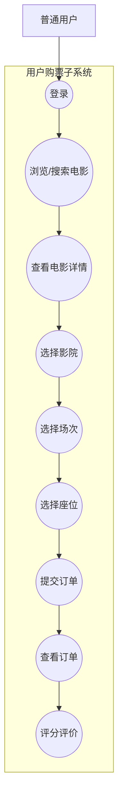
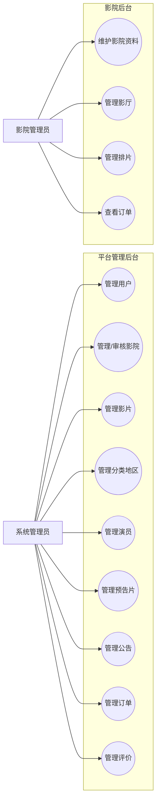
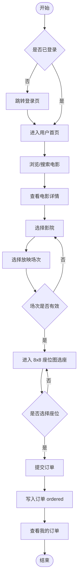
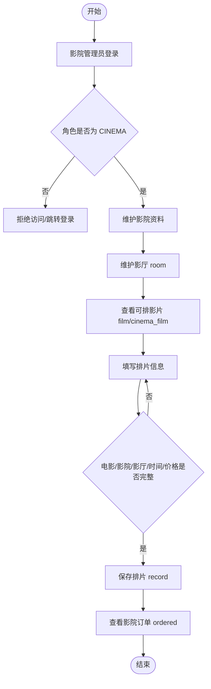
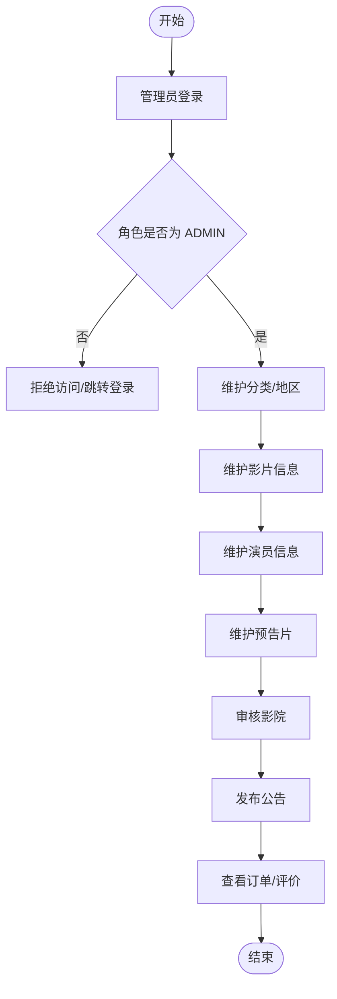
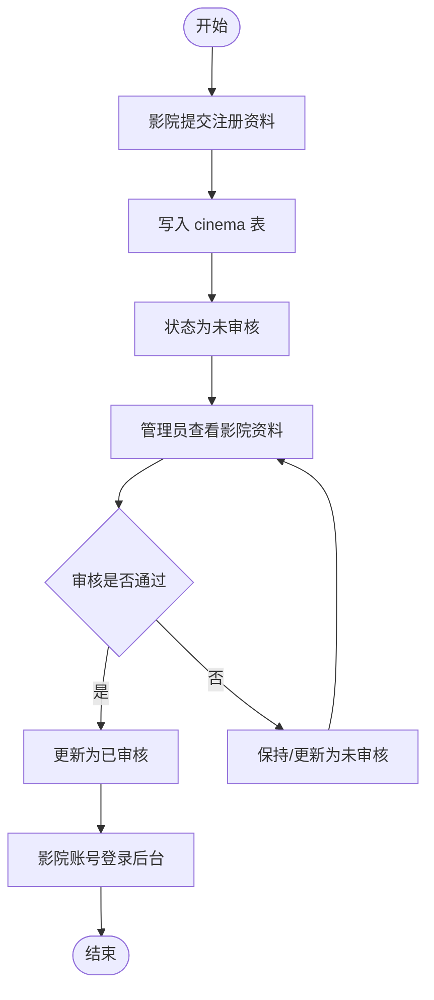
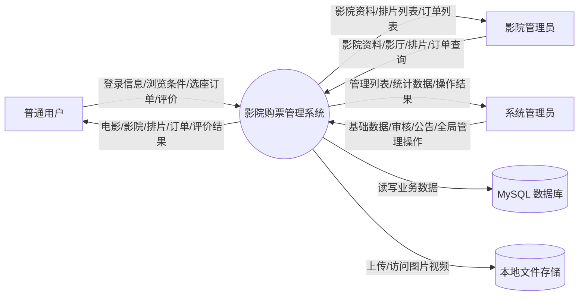
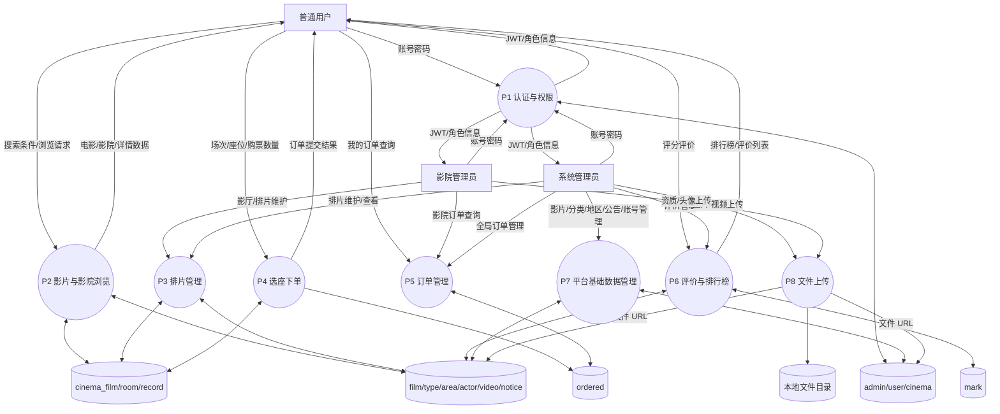
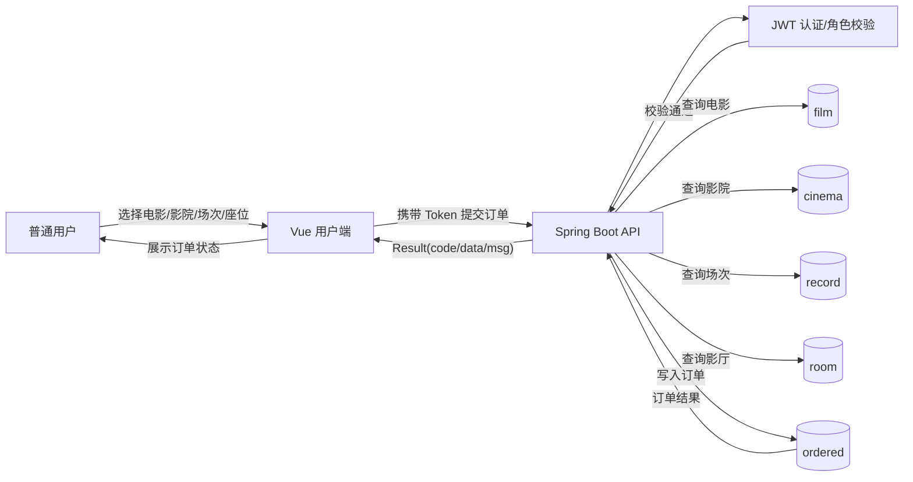

# 用例图、业务流程图与数据流图

本文档补充影院购票管理系统需求阶段常用的三类建模图：用例图、业务流程图、数据流图。图中只表达当前 V1.0 已实现或已在 PRD 中明确的能力，后续扩展能力放在[PRD 优化路线图](./04-prd-optimization-roadmap.md)中说明。

## 1. 用例图

### 1.1 系统总用例图

```mermaid
flowchart LR
    USER["普通用户<br/>USER"]
    CINEMA["影院管理员<br/>CINEMA"]
    ADMIN["系统管理员<br/>ADMIN"]

    subgraph SYS["影院购票管理系统"]
        UC_LOGIN(("登录/注册"))
        UC_PROFILE(("维护个人资料"))
        UC_PASSWORD(("修改密码"))

        UC_BROWSE_FILM(("浏览电影"))
        UC_SEARCH(("搜索影片"))
        UC_RANK(("查看排行榜"))
        UC_FILM_DETAIL(("查看电影详情"))
        UC_BROWSE_CINEMA(("浏览影院"))
        UC_SELECT_RECORD(("选择影院与场次"))
        UC_SELECT_SEAT(("在线选座"))
        UC_CREATE_ORDER(("提交订单"))
        UC_VIEW_ORDER(("查看订单"))
        UC_MARK(("评分评价"))

        UC_CINEMA_PROFILE(("维护影院资料"))
        UC_ROOM(("管理影厅"))
        UC_RECORD(("管理排片"))
        UC_CINEMA_ORDER(("查看影院订单"))
        UC_CINEMA_FILM(("查看可排影片"))

        UC_ADMIN_ACCOUNT(("管理账号"))
        UC_AUDIT_CINEMA(("审核影院"))
        UC_FILM_MGMT(("管理影片"))
        UC_BASE_DATA(("管理分类/地区"))
        UC_ACTOR_VIDEO(("管理演员/预告片"))
        UC_NOTICE(("管理公告"))
        UC_ADMIN_ORDER(("管理订单"))
        UC_ADMIN_MARK(("管理评价"))
    end

    USER --> UC_LOGIN
    USER --> UC_PROFILE
    USER --> UC_PASSWORD
    USER --> UC_BROWSE_FILM
    USER --> UC_SEARCH
    USER --> UC_RANK
    USER --> UC_FILM_DETAIL
    USER --> UC_BROWSE_CINEMA
    USER --> UC_SELECT_RECORD
    USER --> UC_SELECT_SEAT
    USER --> UC_CREATE_ORDER
    USER --> UC_VIEW_ORDER
    USER --> UC_MARK

    CINEMA --> UC_LOGIN
    CINEMA --> UC_PASSWORD
    CINEMA --> UC_CINEMA_PROFILE
    CINEMA --> UC_ROOM
    CINEMA --> UC_RECORD
    CINEMA --> UC_CINEMA_ORDER
    CINEMA --> UC_CINEMA_FILM

    ADMIN --> UC_LOGIN
    ADMIN --> UC_PASSWORD
    ADMIN --> UC_ADMIN_ACCOUNT
    ADMIN --> UC_AUDIT_CINEMA
    ADMIN --> UC_FILM_MGMT
    ADMIN --> UC_BASE_DATA
    ADMIN --> UC_ACTOR_VIDEO
    ADMIN --> UC_NOTICE
    ADMIN --> UC_ADMIN_ORDER
    ADMIN --> UC_ADMIN_MARK
```

### 1.2 用户购票用例分解

### 1.3 后台管理用例分解

## 2. 业务流程图

### 2.1 用户购票主流程

业务规则：

- 用户必须登录且角色为 USER 才能进入购票流程。
- 当前版本订单提交后默认进入“待取票”状态。
- 当前座位图为固定 8x8，座位信息以字符串写入 `ordered.seat`。
- 当前版本不包含真实支付和取票码。

### 2.2 影院排片流程

业务规则：

- 排片必须关联影院、影厅和电影。
- `record.cinema_id`、`record.room_id`、`record.film_id` 是排片主链路字段。
- 影院端只能进入 `/back/*` 页面，不能进入管理端 `/manage/*`。

### 2.3 管理员内容运营流程

业务规则：

- 管理员拥有平台全局基础数据管理权限。
- 管理员可以访问 `/manage/*` 全部管理页面。
- 后端 `AuthInterceptor` 对管理端资源进行角色校验。

### 2.4 影院注册与审核流程

## 3. 数据流图

### 3.1 上下文数据流图 DFD Level 0

### 3.2 一层数据流图 DFD Level 1

### 3.3 购票订单数据流图

## 4. 图与当前实现的对应关系

| 图 | 对应代码/数据 | 说明 |
|----|---------------|------|
| 用例图 | `router/index.js`、各 Controller、三端页面 | 按 USER/CINEMA/ADMIN 三角色划分 |
| 用户购票流程 | `/front/*` 页面、`OrderedController`、`ordered` 表 | 当前不含真实支付 |
| 影院排片流程 | `/back/room`、`/back/record`、`room`、`record` 表 | 排片通过 ID 关联影院、影厅、电影 |
| 管理员运营流程 | `/manage/*` 页面、基础数据 Controller | 覆盖影片、影院、订单、评价、公告等后台能力 |
| DFD Level 0 | 前端、后端、MySQL、本地文件存储 | 展示系统外部参与者和数据边界 |
| DFD Level 1 | 认证、浏览、排片、下单、订单、评价、文件上传 | 展示主要数据处理过程和数据存储 |

## 5. 后续可扩展图

如果进入二期迭代，可以继续补充：

- 支付状态机图。
- 退票/改签流程图。
- 影院对象级权限校验流程图。
- 动态座位模板数据流图。
- 管理端运营看板数据流图。
