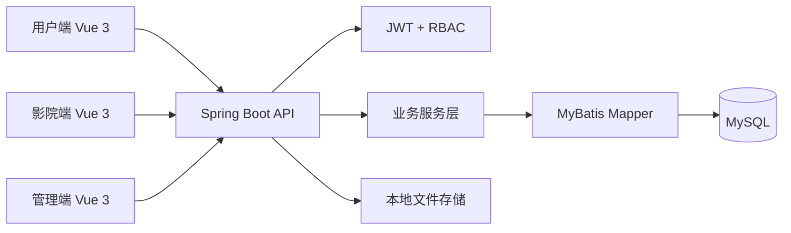

# Resume-Grade Fullstack Upgrade Implementation Plan

> **For agentic workers:** REQUIRED SUB-SKILL: Use superpowers:subagent-driven-development (recommended) or superpowers:executing-plans to implement this plan task-by-task. Steps use checkbox (`- [ ]`) syntax for tracking.

**Goal:** Upgrade the cinema ticket management system into a resume-grade Java backend and fullstack portfolio project with stronger backend boundaries, tests, deployment, documentation, and interview material.

**Architecture:** Keep the project as a Spring Boot 3 + Vue 3 + MySQL monolith. Improve the highest-value boundaries first: API errors, DTO validation, RBAC/data scoping, order consistency, deployment configuration, and portfolio documentation.

**Tech Stack:** Spring Boot 3.3, Java 17, MyBatis, MySQL 8, Vue 3, Vite, Element Plus, Axios, Playwright, Docker Compose, GitHub Actions.

---

## Scope Check

This plan is intentionally a master plan for the approved 14-day standard upgrade. It is split into independent implementation tasks so each task can be executed and reviewed separately. Do not introduce microservices, message queues, Kubernetes, Elasticsearch, or a payment system in this plan.

## File Structure Map

### Backend

- `xm_film/springboot/src/main/java/com/example/springboot/common/Result.java`  
  Keep the public response envelope stable while adding named helpers where needed.

- `xm_film/springboot/src/main/java/com/example/springboot/common/enums/ErrorCode.java`  
  New enum for stable API error codes.

- `xm_film/springboot/src/main/java/com/example/springboot/exception/CustomException.java`  
  Extend to accept `ErrorCode` while preserving the current string constructor.

- `xm_film/springboot/src/main/java/com/example/springboot/exception/GlobalExceptionHandler.java`  
  Add validation exception handling and consistent business error handling.

- `xm_film/springboot/src/main/java/com/example/springboot/dto/request/*.java`  
  New request DTOs for login, order creation, order status update, and health-check-neutral API input.

- `xm_film/springboot/src/main/java/com/example/springboot/dto/response/*.java`  
  New response VOs for safe auth and order responses when needed.

- `xm_film/springboot/src/main/java/com/example/springboot/controller/AuthController.java`  
  Move login/register/password request bodies to DTOs and keep existing API paths.

- `xm_film/springboot/src/main/java/com/example/springboot/controller/OrderedController.java`  
  Expose explicit order operations for create/cancel/pickup with authenticated scope.

- `xm_film/springboot/src/main/java/com/example/springboot/service/OrderedService.java`  
  Strengthen order state transitions, duplicate-seat checks, scoped access, and transactional behavior.

- `xm_film/springboot/src/main/resources/mapper/OrderedMapper.xml`  
  Add SQL support for active seat checks and scoped order queries if missing.

- `xm_film/sql/schema.sql` and `xm_film/springboot/src/main/resources/db/schema.sql`  
  Keep database schema copies in sync for indexes and duplicate-seat protection.

- `xm_film/springboot/src/test/java/com/example/springboot/*.java`  
  Add Spring Boot tests for auth, authorization, and order behavior.

### Frontend

- `xm_film/vue/src/utils/request.js`  
  Keep token injection and make 401/403 handling consistent for demos.

- `xm_film/vue/src/views/front/BuyTicket.vue`  
  Confirm failed order submission shows business errors clearly.

- `xm_film/vue/src/views/front/Orders.vue`  
  Confirm order status and cancel behavior are readable for the demo.

- `xm_film/vue/src/views/back/*.vue` and `xm_film/vue/src/views/manage/*.vue`  
  Touch only pages needed for visible data isolation or demo polish.

- `xm_film/vue/e2e-tests/e2e-scan.spec.mjs`  
  Extend only when a new behavior has a stable automated path.

### Deployment And Documentation

- `.env.example`  
  New production-style environment variable template.

- `docker-compose.yml`  
  Keep one-command local deployment, adding health checks and production env wiring.

- `Dockerfile`  
  Confirm backend/frontend build path is reproducible.

- `xm_film/springboot/src/main/resources/application-prod.yml`  
  New production profile driven by environment variables.

- `README.md`, `CHANGELOG.md`, `Bug.md`, `AGENTS.md`  
  Keep the document chain aligned after architecture-level changes.

- `docs/interview/*.md`  
  New resume and interview material.

---

## Task 1: Repository Hygiene And Baseline Verification

**Files:**
- Modify: `.gitignore`
- Modify: `README.md`
- Modify: `CHANGELOG.md`
- Leave untouched unless explicitly approved: `docs/repo-health-brief.md`

- [ ] **Step 1: Capture current status**

Run:

```bash
git status --short
git log --oneline -5
```

Expected: `docs/repo-health-brief.md` may appear as untracked. Do not stage it unless the user asks.

- [ ] **Step 2: Identify generated files**

Run:

```bash
git ls-files | rg "(\.log$|playwright-report|screenshots|node_modules|target/|dist/)"
Get-ChildItem -Force | Where-Object { $_.Name -match '\.log$' } | Select-Object Name,Length
```

Expected: the command lists tracked or local generated artifacts that should not be part of the portfolio surface.

- [ ] **Step 3: Update `.gitignore` if a generated category is missing**

Add these entries only if they are not already present:

```gitignore
*.log
xm_film/vue/e2e-tests/playwright-report/
xm_film/vue/e2e-tests/screenshots/
xm_film/vue/dist/
xm_film/springboot/target/
springboot-jar/
```

- [ ] **Step 4: Run baseline backend build**

Run:

```bash
cd xm_film/springboot
mvn test
```

Expected: Maven exits with code 0. If it fails, record the failing test or compile error in `Bug.md` before fixing.

- [ ] **Step 5: Run baseline frontend build**

Run:

```bash
cd xm_film/vue
npm install
npm run build
```

Expected: Vite exits with code 0 and writes build output under `xm_film/vue/dist`.

- [ ] **Step 6: Commit hygiene changes**

Run:

```bash
git add .gitignore README.md CHANGELOG.md
git commit -m "chore: clean portfolio project baseline"
```

Expected: commit succeeds. If only verification was performed and no files changed, skip the commit.

---

## Task 2: API Error Codes And Validation Handling

**Files:**
- Create: `xm_film/springboot/src/main/java/com/example/springboot/common/enums/ErrorCode.java`
- Modify: `xm_film/springboot/src/main/java/com/example/springboot/exception/CustomException.java`
- Modify: `xm_film/springboot/src/main/java/com/example/springboot/exception/GlobalExceptionHandler.java`
- Test: `xm_film/springboot/src/test/java/com/example/springboot/GlobalExceptionHandlerTest.java`

- [ ] **Step 1: Write the failing validation test**

Create `xm_film/springboot/src/test/java/com/example/springboot/GlobalExceptionHandlerTest.java`:

```java
package com.example.springboot;

import com.example.springboot.controller.AuthController;
import com.example.springboot.common.JwtUtils;
import com.example.springboot.service.AdminService;
import com.example.springboot.service.CinemaService;
import com.example.springboot.service.UserService;
import com.fasterxml.jackson.databind.ObjectMapper;
import org.junit.jupiter.api.Test;
import org.springframework.beans.factory.annotation.Autowired;
import org.springframework.boot.test.autoconfigure.web.servlet.WebMvcTest;
import org.springframework.boot.test.mock.mockito.MockBean;
import org.springframework.context.annotation.Import;
import org.springframework.http.MediaType;
import org.springframework.test.web.servlet.MockMvc;
import com.example.springboot.exception.GlobalExceptionHandler;

import static org.springframework.test.web.servlet.request.MockMvcRequestBuilders.post;
import static org.springframework.test.web.servlet.result.MockMvcResultMatchers.jsonPath;
import static org.springframework.test.web.servlet.result.MockMvcResultMatchers.status;

@WebMvcTest(AuthController.class)
@Import(GlobalExceptionHandler.class)
class GlobalExceptionHandlerTest {

    @Autowired
    MockMvc mockMvc;

    @Autowired
    ObjectMapper objectMapper;

    @MockBean
    AdminService adminService;

    @MockBean
    UserService userService;

    @MockBean
    CinemaService cinemaService;

    @MockBean
    JwtUtils jwtUtils;

    @Test
    void loginRejectsBlankUsernameWithParamInvalidCode() throws Exception {
        String body = """
                {"username":"","password":"123456","role":"USER"}
                """;

        mockMvc.perform(post("/api/v1/auth/login")
                        .contentType(MediaType.APPLICATION_JSON)
                        .content(body))
                .andExpect(status().isOk())
                .andExpect(jsonPath("$.code").value("400"))
                .andExpect(jsonPath("$.msg").isNotEmpty());
    }
}
```

- [ ] **Step 2: Run the test to verify it fails**

Run:

```bash
cd xm_film/springboot
mvn -Dtest=GlobalExceptionHandlerTest test
```

Expected: FAIL because `AuthController` still accepts entity-style input or validation does not return `400`.

- [ ] **Step 3: Add `ErrorCode`**

Create `xm_film/springboot/src/main/java/com/example/springboot/common/enums/ErrorCode.java`:

```java
package com.example.springboot.common.enums;

public enum ErrorCode {
    UNAUTHORIZED("401", "登录状态已过期，请重新登录"),
    FORBIDDEN("403", "权限不足"),
    PARAM_INVALID("400", "参数校验失败"),
    NOT_FOUND("404", "资源不存在"),
    BUSINESS_CONFLICT("409", "业务状态冲突"),
    FILE_INVALID("415", "上传文件非法"),
    SYSTEM_ERROR("500", "系统错误");

    private final String code;
    private final String message;

    ErrorCode(String code, String message) {
        this.code = code;
        this.message = message;
    }

    public String code() {
        return code;
    }

    public String message() {
        return message;
    }
}
```

- [ ] **Step 4: Extend `CustomException`**

Modify `xm_film/springboot/src/main/java/com/example/springboot/exception/CustomException.java`:

```java
package com.example.springboot.exception;

import com.example.springboot.common.enums.ErrorCode;
import lombok.Data;
import lombok.EqualsAndHashCode;

@Data
@EqualsAndHashCode(callSuper = true)
public class CustomException extends RuntimeException {
    private String code;
    private String msg;

    public CustomException(String code, String msg) {
        super(msg);
        this.code = code;
        this.msg = msg;
    }

    public CustomException(ErrorCode errorCode) {
        this(errorCode.code(), errorCode.message());
    }

    public CustomException(ErrorCode errorCode, String msg) {
        this(errorCode.code(), msg);
    }
}
```

- [ ] **Step 5: Add validation handling**

Modify `xm_film/springboot/src/main/java/com/example/springboot/exception/GlobalExceptionHandler.java` by adding imports:

```java
import com.example.springboot.common.enums.ErrorCode;
import org.springframework.web.bind.MethodArgumentNotValidException;
import java.util.stream.Collectors;
```

Add this handler above the generic `Exception` handler:

```java
@ExceptionHandler(MethodArgumentNotValidException.class)
@ResponseBody
public Result validationError(MethodArgumentNotValidException e) {
    String message = e.getBindingResult().getFieldErrors().stream()
            .map(error -> error.getField() + ": " + error.getDefaultMessage())
            .collect(Collectors.joining("; "));
    logger.warn("参数校验失败: {}", message);
    return Result.error(ErrorCode.PARAM_INVALID.code(), message);
}
```

- [ ] **Step 6: Run the focused test**

Run:

```bash
cd xm_film/springboot
mvn -Dtest=GlobalExceptionHandlerTest test
```

Expected: PASS.

- [ ] **Step 7: Commit**

Run:

```bash
git add xm_film/springboot/src/main/java/com/example/springboot/common/enums/ErrorCode.java xm_film/springboot/src/main/java/com/example/springboot/exception/CustomException.java xm_film/springboot/src/main/java/com/example/springboot/exception/GlobalExceptionHandler.java xm_film/springboot/src/test/java/com/example/springboot/GlobalExceptionHandlerTest.java
git commit -m "feat: standardize api error handling"
```

---

## Task 3: Auth DTO Validation

**Files:**
- Create: `xm_film/springboot/src/main/java/com/example/springboot/dto/request/LoginRequest.java`
- Create: `xm_film/springboot/src/main/java/com/example/springboot/dto/request/PasswordChangeRequest.java`
- Modify: `xm_film/springboot/src/main/java/com/example/springboot/controller/AuthController.java`
- Test: `xm_film/springboot/src/test/java/com/example/springboot/GlobalExceptionHandlerTest.java`

- [ ] **Step 1: Inspect current auth controller**

Run:

```bash
Get-Content xm_film/springboot/src/main/java/com/example/springboot/controller/AuthController.java
```

Expected: identify the existing login/register/password method names and preserve their routes.

- [ ] **Step 2: Create `LoginRequest`**

Create `xm_film/springboot/src/main/java/com/example/springboot/dto/request/LoginRequest.java`:

```java
package com.example.springboot.dto.request;

import jakarta.validation.constraints.NotBlank;
import lombok.Data;

@Data
public class LoginRequest {
    @NotBlank(message = "用户名不能为空")
    private String username;

    @NotBlank(message = "密码不能为空")
    private String password;

    @NotBlank(message = "角色不能为空")
    private String role;
}
```

- [ ] **Step 3: Create `PasswordChangeRequest`**

Create `xm_film/springboot/src/main/java/com/example/springboot/dto/request/PasswordChangeRequest.java`:

```java
package com.example.springboot.dto.request;

import jakarta.validation.constraints.NotBlank;
import lombok.Data;

@Data
public class PasswordChangeRequest {
    @NotBlank(message = "原密码不能为空")
    private String password;

    @NotBlank(message = "新密码不能为空")
    private String newPassword;
}
```

- [ ] **Step 4: Update `AuthController` method signatures**

In `xm_film/springboot/src/main/java/com/example/springboot/controller/AuthController.java`, import:

```java
import com.example.springboot.dto.request.LoginRequest;
import com.example.springboot.dto.request.PasswordChangeRequest;
import jakarta.validation.Valid;
```

Change the login method body to map DTO values into the existing account flow:

```java
@PostMapping("/login")
public Result login(@Valid @RequestBody LoginRequest request) {
    Account account = new Account();
    account.setUsername(request.getUsername());
    account.setPassword(request.getPassword());
    account.setRole(request.getRole());
    return Result.success(authService.login(account));
}
```

If the controller currently dispatches directly to `adminService`, `userService`, or `cinemaService`, keep that dispatch and replace only the request parameter and field reads.

- [ ] **Step 5: Update password change input**

Change the password endpoint parameter to:

```java
public Result updatePassword(@Valid @RequestBody PasswordChangeRequest request, HttpServletRequest httpRequest)
```

Then copy validated values into the existing password-change object or service call:

```java
Account account = new Account();
account.setPassword(request.getPassword());
account.setNewPassword(request.getNewPassword());
```

- [ ] **Step 6: Run focused auth tests**

Run:

```bash
cd xm_film/springboot
mvn -Dtest=GlobalExceptionHandlerTest test
```

Expected: PASS.

- [ ] **Step 7: Run backend tests**

Run:

```bash
cd xm_film/springboot
mvn test
```

Expected: PASS.

- [ ] **Step 8: Commit**

Run:

```bash
git add xm_film/springboot/src/main/java/com/example/springboot/dto/request/LoginRequest.java xm_film/springboot/src/main/java/com/example/springboot/dto/request/PasswordChangeRequest.java xm_film/springboot/src/main/java/com/example/springboot/controller/AuthController.java xm_film/springboot/src/test/java/com/example/springboot/GlobalExceptionHandlerTest.java
git commit -m "feat: validate auth request payloads"
```

---

## Task 4: Order Request DTO And State Operations

**Files:**
- Create: `xm_film/springboot/src/main/java/com/example/springboot/dto/request/OrderCreateRequest.java`
- Modify: `xm_film/springboot/src/main/java/com/example/springboot/controller/OrderedController.java`
- Modify: `xm_film/springboot/src/main/java/com/example/springboot/service/OrderedService.java`
- Test: `xm_film/springboot/src/test/java/com/example/springboot/OrderedServiceTest.java`

- [ ] **Step 1: Write service tests for state transitions**

Create `xm_film/springboot/src/test/java/com/example/springboot/OrderedServiceTest.java`:

```java
package com.example.springboot;

import com.example.springboot.entity.Ordered;
import com.example.springboot.exception.CustomException;
import com.example.springboot.mapper.FilmMapper;
import com.example.springboot.mapper.OrderedMapper;
import com.example.springboot.mapper.RecordMapper;
import com.example.springboot.service.OrderedService;
import org.junit.jupiter.api.Test;
import org.springframework.boot.test.context.SpringBootTest;
import org.springframework.boot.test.mock.mockito.MockBean;
import org.springframework.beans.factory.annotation.Autowired;

import static org.assertj.core.api.Assertions.assertThatThrownBy;
import static org.mockito.Mockito.when;

@SpringBootTest(classes = OrderedService.class)
class OrderedServiceTest {

    @Autowired
    OrderedService orderedService;

    @MockBean
    OrderedMapper orderedMapper;

    @MockBean
    RecordMapper recordMapper;

    @MockBean
    FilmMapper filmMapper;

    @Test
    void userCannotCancelAnotherUsersOrder() {
        Ordered ordered = new Ordered();
        ordered.setId(1);
        ordered.setUserId(100);
        ordered.setStatus("待取票");
        when(orderedMapper.selectById(1)).thenReturn(ordered);

        assertThatThrownBy(() -> orderedService.cancelOrder(1, "USER", 200))
                .isInstanceOf(CustomException.class)
                .hasMessageContaining("无权");
    }

    @Test
    void cancelledOrderCannotBePickedUp() {
        Ordered ordered = new Ordered();
        ordered.setId(1);
        ordered.setCinemaId(10);
        ordered.setStatus("已取消");
        when(orderedMapper.selectById(1)).thenReturn(ordered);

        assertThatThrownBy(() -> orderedService.pickupOrder(1, "CINEMA", 10))
                .isInstanceOf(CustomException.class)
                .hasMessageContaining("状态");
    }
}
```

- [ ] **Step 2: Run the test to verify it fails**

Run:

```bash
cd xm_film/springboot
mvn -Dtest=OrderedServiceTest test
```

Expected: FAIL because `cancelOrder` and `pickupOrder` do not exist yet.

- [ ] **Step 3: Create `OrderCreateRequest`**

Create `xm_film/springboot/src/main/java/com/example/springboot/dto/request/OrderCreateRequest.java`:

```java
package com.example.springboot.dto.request;

import jakarta.validation.constraints.NotBlank;
import jakarta.validation.constraints.NotNull;
import lombok.Data;

@Data
public class OrderCreateRequest {
    @NotNull(message = "放映场次不能为空")
    private Integer recordId;

    @NotBlank(message = "座位不能为空")
    private String seat;
}
```

- [ ] **Step 4: Add order state methods**

Add these methods to `xm_film/springboot/src/main/java/com/example/springboot/service/OrderedService.java`:

```java
@Transactional(rollbackFor = Exception.class)
public void cancelOrder(Integer id, String role, Integer userId) {
    Ordered ordered = selectById(id);
    ensureOrderAccess(ordered, role, userId);
    if (!"待取票".equals(ordered.getStatus())) {
        throw new CustomException("409", "当前状态不允许取消订单");
    }
    Ordered update = new Ordered();
    update.setId(id);
    update.setStatus("已取消");
    orderedMapper.updateById(update);
}

@Transactional(rollbackFor = Exception.class)
public void pickupOrder(Integer id, String role, Integer userId) {
    Ordered ordered = selectById(id);
    ensureOrderAccess(ordered, role, userId);
    if ("USER".equals(role)) {
        throw new CustomException("403", "用户无权执行取票操作");
    }
    if (!"待取票".equals(ordered.getStatus())) {
        throw new CustomException("409", "当前状态不允许取票");
    }
    Ordered update = new Ordered();
    update.setId(id);
    update.setStatus("已取票");
    orderedMapper.updateById(update);
}
```

- [ ] **Step 5: Add explicit controller endpoints**

In `xm_film/springboot/src/main/java/com/example/springboot/controller/OrderedController.java`, add imports:

```java
import com.example.springboot.dto.request.OrderCreateRequest;
import jakarta.servlet.http.HttpServletRequest;
import jakarta.validation.Valid;
```

Add endpoints while preserving existing CRUD endpoints:

```java
@PostMapping("/create")
public Result createOrder(@Valid @RequestBody OrderCreateRequest request, HttpServletRequest httpRequest) {
    Ordered ordered = new Ordered();
    ordered.setRecordId(request.getRecordId());
    ordered.setSeat(request.getSeat());
    orderedService.createOrder(ordered, (String) httpRequest.getAttribute("role"), Integer.valueOf((String) httpRequest.getAttribute("userId")));
    return Result.success();
}

@PutMapping("/{id}/cancel")
public Result cancel(@PathVariable Integer id, HttpServletRequest httpRequest) {
    orderedService.cancelOrder(id, (String) httpRequest.getAttribute("role"), Integer.valueOf((String) httpRequest.getAttribute("userId")));
    return Result.success();
}

@PutMapping("/{id}/pickup")
public Result pickup(@PathVariable Integer id, HttpServletRequest httpRequest) {
    orderedService.pickupOrder(id, (String) httpRequest.getAttribute("role"), Integer.valueOf((String) httpRequest.getAttribute("userId")));
    return Result.success();
}
```

If `userId` is already stored as `Integer` in the request attribute, use a helper:

```java
private Integer currentUserId(HttpServletRequest request) {
    Object value = request.getAttribute("userId");
    return value instanceof Integer ? (Integer) value : Integer.valueOf(String.valueOf(value));
}
```

- [ ] **Step 6: Run focused order tests**

Run:

```bash
cd xm_film/springboot
mvn -Dtest=OrderedServiceTest test
```

Expected: PASS.

- [ ] **Step 7: Commit**

Run:

```bash
git add xm_film/springboot/src/main/java/com/example/springboot/dto/request/OrderCreateRequest.java xm_film/springboot/src/main/java/com/example/springboot/controller/OrderedController.java xm_film/springboot/src/main/java/com/example/springboot/service/OrderedService.java xm_film/springboot/src/test/java/com/example/springboot/OrderedServiceTest.java
git commit -m "feat: add explicit order state operations"
```

---

## Task 5: Duplicate Seat Protection And Database Indexes

**Files:**
- Modify: `xm_film/sql/schema.sql`
- Modify: `xm_film/springboot/src/main/resources/db/schema.sql`
- Modify: `xm_film/springboot/src/main/resources/mapper/OrderedMapper.xml`
- Modify: `xm_film/springboot/src/main/java/com/example/springboot/mapper/OrderedMapper.java`
- Test: `xm_film/springboot/src/test/java/com/example/springboot/OrderedSeatConflictTest.java`

- [ ] **Step 1: Inspect current order schema**

Run:

```bash
Select-String -Path xm_film/sql/schema.sql -Pattern "CREATE TABLE.*ordered|record_id|seat|status|INDEX|KEY" -Context 2,6
Select-String -Path xm_film/springboot/src/main/resources/db/schema.sql -Pattern "CREATE TABLE.*ordered|record_id|seat|status|INDEX|KEY" -Context 2,6
```

Expected: identify existing indexes and whether `record_id`, `seat`, and `status` are indexed.

- [ ] **Step 2: Add supporting indexes**

In both schema files, add these indexes inside the `ordered` table definition if missing:

```sql
KEY `idx_ordered_user_id` (`user_id`),
KEY `idx_ordered_record_id` (`record_id`),
KEY `idx_ordered_cinema_id` (`cinema_id`),
KEY `idx_ordered_status` (`status`)
```

Do not add a unique index over raw `seat` if one order can store multiple comma-separated seats. Use service-level per-seat conflict checks in this version.

- [ ] **Step 3: Ensure mapper supports active seat checks**

In `xm_film/springboot/src/main/java/com/example/springboot/mapper/OrderedMapper.java`, ensure this method exists:

```java
int countSeatInUse(@Param("recordId") Integer recordId, @Param("seat") String seat);
```

Also ensure `org.apache.ibatis.annotations.Param` is imported.

- [ ] **Step 4: Ensure XML checks only active orders**

In `xm_film/springboot/src/main/resources/mapper/OrderedMapper.xml`, add or adjust:

```xml
<select id="countSeatInUse" resultType="int">
    SELECT COUNT(*)
    FROM ordered
    WHERE record_id = #{recordId}
      AND status != '已取消'
      AND FIND_IN_SET(#{seat}, REPLACE(seat, '，', ','))
</select>
```

- [ ] **Step 5: Add a focused SQL mapping test**

Create `xm_film/springboot/src/test/java/com/example/springboot/OrderedSeatConflictTest.java`:

```java
package com.example.springboot;

import com.example.springboot.mapper.OrderedMapper;
import org.junit.jupiter.api.Test;
import org.mybatis.spring.boot.test.autoconfigure.MybatisTest;
import org.springframework.beans.factory.annotation.Autowired;

import static org.assertj.core.api.Assertions.assertThat;

@MybatisTest
class OrderedSeatConflictTest {

    @Autowired
    OrderedMapper orderedMapper;

    @Test
    void mapperLoadsCountSeatInUseStatement() {
        int count = orderedMapper.countSeatInUse(-1, "1排1座");
        assertThat(count).isZero();
    }
}
```

- [ ] **Step 6: Run mapper test**

Run:

```bash
cd xm_film/springboot
mvn -Dtest=OrderedSeatConflictTest test
```

Expected: PASS. If the test cannot connect because `@MybatisTest` needs a datasource, convert it to `@SpringBootTest` with the CI test profile already used by the project.

- [ ] **Step 7: Commit**

Run:

```bash
git add xm_film/sql/schema.sql xm_film/springboot/src/main/resources/db/schema.sql xm_film/springboot/src/main/resources/mapper/OrderedMapper.xml xm_film/springboot/src/main/java/com/example/springboot/mapper/OrderedMapper.java xm_film/springboot/src/test/java/com/example/springboot/OrderedSeatConflictTest.java
git commit -m "feat: strengthen order seat conflict checks"
```

---

## Task 6: RBAC Matrix And Data Isolation Tests

**Files:**
- Create: `docs/interview/05-rbac-matrix.md`
- Test: `xm_film/springboot/src/test/java/com/example/springboot/AuthInterceptorAccessTest.java`
- Modify: `xm_film/springboot/src/main/java/com/example/springboot/common/config/AuthInterceptor.java`

- [ ] **Step 1: Write the RBAC matrix document**

Create `docs/interview/05-rbac-matrix.md`:

```markdown
# RBAC 权限矩阵

| 资源 | ADMIN | CINEMA | USER |
|---|---|---|---|
| 管理员 | 全部管理 | 禁止 | 禁止 |
| 用户 | 全部管理 | 禁止 | 仅本人资料 |
| 影院 | 全部管理/审核 | 仅本影院资料 | 只读 |
| 影厅 | 全部管理 | 仅本影院影厅 | 禁止 |
| 排片 | 全部管理 | 仅本影院排片 | 只读 |
| 订单 | 全部管理 | 仅本影院订单 | 仅本人订单 |
| 影片/分类/地区/演员 | 全部管理 | 只读影片 | 只读 |
| 公告/视频 | 全部管理 | 只读 | 只读 |

## 后端执行点

- `AuthInterceptor` 处理通用资源和写操作边界。
- `OrderedService.ensureOrderAccess` 处理订单所属权边界。
- 影院端资源查询在 service/controller 层注入 `cinemaId` scope。
- 用户订单查询在 service/controller 层注入 `userId` scope。
```

- [ ] **Step 2: Write interceptor access tests**

Create `xm_film/springboot/src/test/java/com/example/springboot/AuthInterceptorAccessTest.java`:

```java
package com.example.springboot;

import com.example.springboot.common.JwtUtils;
import com.example.springboot.common.config.AuthInterceptor;
import jakarta.servlet.http.HttpServletRequest;
import jakarta.servlet.http.HttpServletResponse;
import org.junit.jupiter.api.Test;
import org.springframework.test.util.ReflectionTestUtils;

import static org.assertj.core.api.Assertions.assertThat;
import static org.mockito.Mockito.mock;

class AuthInterceptorAccessTest {

    @Test
    void cinemaCannotWriteFilms() throws Exception {
        AuthInterceptor interceptor = new AuthInterceptor();
        ReflectionTestUtils.setField(interceptor, "jwtUtils", mock(JwtUtils.class));

        boolean access = (boolean) ReflectionTestUtils.invokeMethod(
                interceptor,
                "hasAccess",
                "/api/v1/films",
                "POST",
                "CINEMA"
        );

        assertThat(access).isFalse();
    }

    @Test
    void adminCanWriteFilms() throws Exception {
        AuthInterceptor interceptor = new AuthInterceptor();
        ReflectionTestUtils.setField(interceptor, "jwtUtils", mock(JwtUtils.class));

        boolean access = (boolean) ReflectionTestUtils.invokeMethod(
                interceptor,
                "hasAccess",
                "/api/v1/films",
                "POST",
                "ADMIN"
        );

        assertThat(access).isTrue();
    }
}
```

- [ ] **Step 3: Run the focused test**

Run:

```bash
cd xm_film/springboot
mvn -Dtest=AuthInterceptorAccessTest test
```

Expected: PASS if the current private method is accessible through `ReflectionTestUtils`. If method access fails, change `hasAccess` from `private` to package-private and rerun.

- [ ] **Step 4: Review route boundaries**

Run:

```bash
Select-String -Path xm_film/springboot/src/main/java/com/example/springboot/common/config/AuthInterceptor.java -Pattern "ADMIN_ONLY_PREFIXES|ADMIN_WRITE_PREFIXES|hasAccess" -Context 0,20
```

Expected: protected write routes include film writes and admin-only resources. Add `/api/v1/rooms`, `/api/v1/records`, and `/api/v1/orders` only if service-level scoping is not already enforcing ownership.

- [ ] **Step 5: Commit**

Run:

```bash
git add docs/interview/05-rbac-matrix.md xm_film/springboot/src/test/java/com/example/springboot/AuthInterceptorAccessTest.java xm_film/springboot/src/main/java/com/example/springboot/common/config/AuthInterceptor.java
git commit -m "docs: document rbac and verify route access"
```

---

## Task 7: Production Configuration And Health Check

**Files:**
- Create: `xm_film/springboot/src/main/java/com/example/springboot/controller/HealthController.java`
- Create: `xm_film/springboot/src/main/resources/application-prod.yml`
- Create: `.env.example`
- Modify: `docker-compose.yml`
- Test: `xm_film/springboot/src/test/java/com/example/springboot/HealthControllerTest.java`

- [ ] **Step 1: Write health controller test**

Create `xm_film/springboot/src/test/java/com/example/springboot/HealthControllerTest.java`:

```java
package com.example.springboot;

import com.example.springboot.controller.HealthController;
import org.junit.jupiter.api.Test;
import org.springframework.beans.factory.annotation.Autowired;
import org.springframework.boot.test.autoconfigure.web.servlet.WebMvcTest;
import org.springframework.test.web.servlet.MockMvc;

import static org.springframework.test.web.servlet.request.MockMvcRequestBuilders.get;
import static org.springframework.test.web.servlet.result.MockMvcResultMatchers.jsonPath;
import static org.springframework.test.web.servlet.result.MockMvcResultMatchers.status;

@WebMvcTest(HealthController.class)
class HealthControllerTest {

    @Autowired
    MockMvc mockMvc;

    @Test
    void healthReturnsUp() throws Exception {
        mockMvc.perform(get("/api/v1/health"))
                .andExpect(status().isOk())
                .andExpect(jsonPath("$.code").value("200"))
                .andExpect(jsonPath("$.data.status").value("UP"));
    }
}
```

- [ ] **Step 2: Run the test to verify it fails**

Run:

```bash
cd xm_film/springboot
mvn -Dtest=HealthControllerTest test
```

Expected: FAIL because `HealthController` does not exist.

- [ ] **Step 3: Add health controller**

Create `xm_film/springboot/src/main/java/com/example/springboot/controller/HealthController.java`:

```java
package com.example.springboot.controller;

import com.example.springboot.common.Result;
import org.springframework.web.bind.annotation.GetMapping;
import org.springframework.web.bind.annotation.RequestMapping;
import org.springframework.web.bind.annotation.RestController;

import java.time.OffsetDateTime;
import java.util.Map;

@RestController
@RequestMapping("/api/v1/health")
public class HealthController {

    @GetMapping
    public Result health() {
        return Result.success(Map.of(
                "status", "UP",
                "time", OffsetDateTime.now().toString()
        ));
    }
}
```

- [ ] **Step 4: Add production profile**

Create `xm_film/springboot/src/main/resources/application-prod.yml`:

```yaml
server:
  port: ${SERVER_PORT:9090}

spring:
  datasource:
    driver-class-name: com.mysql.cj.jdbc.Driver
    url: ${DB_URL:jdbc:mysql://mysql:3306/xm-film?serverTimezone=Asia/Shanghai&useUnicode=true&characterEncoding=utf-8&useSSL=false&allowPublicKeyRetrieval=true}
    username: ${DB_USERNAME:root}
    password: ${DB_PASSWORD}

logging:
  level:
    com.example.springboot.mapper: ${MYBATIS_LOG_LEVEL:WARN}

app:
  jwt:
    secret: ${JWT_SECRET}
    expire: ${JWT_EXPIRE:86400000}
  file:
    upload-dir: ${FILE_UPLOAD_DIR:/app/uploads}
```

- [ ] **Step 5: Add environment template**

Create `.env.example`:

```dotenv
SERVER_PORT=9090
DB_URL=jdbc:mysql://mysql:3306/xm-film?serverTimezone=Asia/Shanghai&useUnicode=true&characterEncoding=utf-8&useSSL=false&allowPublicKeyRetrieval=true
DB_USERNAME=root
DB_PASSWORD=change-me
MYSQL_ROOT_PASSWORD=change-me
JWT_SECRET=replace-with-at-least-32-random-characters
JWT_EXPIRE=86400000
FILE_UPLOAD_DIR=/app/uploads
MYBATIS_LOG_LEVEL=WARN
VITE_API_BASE_URL=http://localhost:9090
```

- [ ] **Step 6: Wire health check into Docker Compose**

In `docker-compose.yml`, ensure backend service has:

```yaml
healthcheck:
  test: ["CMD", "curl", "-f", "http://localhost:9090/api/v1/health"]
  interval: 30s
  timeout: 5s
  retries: 5
```

If the backend image does not include `curl`, use:

```yaml
healthcheck:
  test: ["CMD-SHELL", "wget -qO- http://localhost:9090/api/v1/health || exit 1"]
  interval: 30s
  timeout: 5s
  retries: 5
```

- [ ] **Step 7: Run health test**

Run:

```bash
cd xm_film/springboot
mvn -Dtest=HealthControllerTest test
```

Expected: PASS.

- [ ] **Step 8: Commit**

Run:

```bash
git add xm_film/springboot/src/main/java/com/example/springboot/controller/HealthController.java xm_film/springboot/src/main/resources/application-prod.yml .env.example docker-compose.yml xm_film/springboot/src/test/java/com/example/springboot/HealthControllerTest.java
git commit -m "feat: add production health configuration"
```

---

## Task 8: Frontend Demo Error Handling

**Files:**
- Modify: `xm_film/vue/src/utils/request.js`
- Modify: `xm_film/vue/src/views/front/BuyTicket.vue`
- Modify: `xm_film/vue/src/views/front/Orders.vue`

- [ ] **Step 1: Inspect current error display**

Run:

```bash
Get-Content xm_film/vue/src/utils/request.js
Select-String -Path xm_film/vue/src/views/front/BuyTicket.vue -Pattern "request|ElMessage|ordered|seat|submit" -Context 2,4
Select-String -Path xm_film/vue/src/views/front/Orders.vue -Pattern "cancel|status|ElMessage|request" -Context 2,4
```

Expected: identify whether API business messages are surfaced to the user.

- [ ] **Step 2: Preserve backend business messages**

In `xm_film/vue/src/utils/request.js`, change the error handler to prefer backend `msg`:

```javascript
  error => {
    const status = error.response?.status
    const backendMessage = error.response?.data?.msg

    if (backendMessage) {
      ElMessage.error(backendMessage)
      return Promise.reject(error)
    }

    switch (status) {
      case 401:
        ElMessage.warning('登录状态已过期，请重新登录')
        break
      case 403:
        ElMessage.error('权限不足，无法访问')
        break
      case 404:
        ElMessage.error('未找到请求接口')
        break
      case 500:
        ElMessage.error('系统异常，请检查后端控制台报错')
        break
      default:
        ElMessage.error(`请求失败: ${error.message}`)
    }

    return Promise.reject(error)
  }
```

- [ ] **Step 3: Confirm order submit catches errors**

In `BuyTicket.vue`, ensure the order submit method does not show success after a rejected request:

```javascript
try {
  const res = await request.post('/api/v1/orders/create', {
    recordId: recordId.value,
    seat: selectedSeats.value.join(',')
  })
  if (res.code === '200') {
    ElMessage.success('下单成功')
    router.push('/front/orders')
  } else {
    ElMessage.error(res.msg || '下单失败')
  }
} catch (error) {
  // request.js has already shown the backend message.
}
```

- [ ] **Step 4: Confirm cancel operation uses explicit endpoint**

In `Orders.vue`, use the explicit cancel endpoint once Task 4 is merged:

```javascript
const cancelOrder = async (id) => {
  try {
    const res = await request.put(`/api/v1/orders/${id}/cancel`)
    if (res.code === '200') {
      ElMessage.success('订单已取消')
      await loadOrders()
    } else {
      ElMessage.error(res.msg || '取消失败')
    }
  } catch (error) {
    // request.js has already shown the backend message.
  }
}
```

- [ ] **Step 5: Run frontend build**

Run:

```bash
cd xm_film/vue
npm run build
```

Expected: PASS.

- [ ] **Step 6: Commit**

Run:

```bash
git add xm_film/vue/src/utils/request.js xm_film/vue/src/views/front/BuyTicket.vue xm_film/vue/src/views/front/Orders.vue
git commit -m "fix: surface order business errors in frontend"
```

---

## Task 9: README Portfolio Upgrade

**Files:**
- Modify: `README.md`
- Add images under: `docs/assets/screenshots/` if screenshots are created

- [ ] **Step 1: Capture README inventory**

Run:

```bash
Get-Content README.md -TotalCount 120
```

Expected: identify sections to keep and sections to move lower.

- [ ] **Step 2: Add portfolio opening section**

Add this near the top of `README.md`:

```markdown
# 多角色影院票务运营平台

基于 Spring Boot 3、Vue 3 和 MySQL 构建的多角色影院票务运营平台，覆盖用户购票、影院排片、平台审核、订单流转、权限隔离、CI/E2E 自动化验证与 Docker 化部署。


## 在线演示

| 项目 | 地址 |
|---|---|
| 前端演示 | http://localhost:5173 |
| 后端健康检查 | http://localhost:9090/api/v1/health |

## 测试账号

| 角色 | 用户名 | 密码 |
|---|---|---|
| 管理员 | 999 | 999 |
| 影院管理员 | asks | cinema123 |
| 用户 | zhangsan | user123 |
```

Before cloud deployment is complete, use the local demo addresses above. After Task 12 deploys the project, replace those two addresses with the real public URLs in the same table.

- [ ] **Step 3: Add highlight section**

Add:

```markdown
## 项目亮点

- 多角色 RBAC：管理员、影院端、用户端分离，后端拦截器和业务层共同保证权限边界。
- 订单一致性：购票链路校验排片、座位、订单状态，防止重复购票和越权操作。
- 工程化验证：GitHub Actions 自动执行后端构建、前端构建、MySQL 初始化和 Playwright E2E。
- 部署交付：支持 Docker Compose 轻量化部署，生产配置通过环境变量注入。
- 文档闭环：产品、设计、数据库、接口、安全、Bug 复盘和面试材料同步维护。
```

- [ ] **Step 4: Add architecture diagram**

Add Mermaid diagram:

```markdown
## 架构概览


```

- [ ] **Step 5: Run markdown sanity check**

Run:

```bash
Select-String -Path README.md -Pattern "多角色影院票务运营平台|项目亮点|架构概览|在线演示"
```

Expected: all four sections are found.

- [ ] **Step 6: Commit**

Run:

```bash
git add README.md docs/assets/screenshots
git commit -m "docs: upgrade readme for portfolio presentation"
```

If no screenshots exist yet, omit `docs/assets/screenshots` from `git add`.

---

## Task 10: Interview Material Pack

**Files:**
- Create: `docs/interview/01-resume-bullets.md`
- Create: `docs/interview/02-project-highlights.md`
- Create: `docs/interview/03-technical-challenges.md`
- Create: `docs/interview/04-interview-qa.md`

- [ ] **Step 1: Create resume bullets**

Create `docs/interview/01-resume-bullets.md`:

```markdown
# 简历项目描述

## 一行版

多角色影院票务运营平台：基于 Spring Boot 3、Vue 3、MySQL 构建，支持用户购票、影院排片、平台审核、订单状态流转、权限隔离、CI/E2E 自动化验证与 Docker 化部署。

## 详细版

- 负责设计并实现管理员、影院端、用户端三角色业务闭环，覆盖影片管理、影院排片、在线选座、订单流转、评价和排行榜等核心模块。
- 基于 JWT + RBAC 实现认证授权，通过拦截器和业务层校验保障管理员、影院管理员、普通用户之间的访问边界和数据隔离。
- 优化购票订单链路，增加排片校验、座位合法性校验、重复购票防护和订单状态流转，提升核心交易流程一致性。
- 建设 GitHub Actions 流水线，自动完成后端构建、前端构建、MySQL 初始化、服务启动和 Playwright E2E 验证。
- 完成 Docker Compose 轻量化部署和生产环境配置拆分，支持通过环境变量管理数据库、JWT、上传目录和日志级别。
```

- [ ] **Step 2: Create highlights document**

Create `docs/interview/02-project-highlights.md`:

```markdown
# 项目亮点

## 1. 三端角色分离

项目不是单一后台 CRUD，而是管理员、影院管理员、用户三端协同的票务运营系统。管理员负责全局数据和审核，影院端负责本影院排片与订单，用户端负责浏览、选座、下单和评价。

## 2. 权限与数据隔离

认证使用 JWT，通用权限由 `AuthInterceptor` 处理，订单等强业务边界在 Service 层二次校验。这样既能统一拦截明显越权请求，也能在具体业务中校验资源归属。

## 3. 订单一致性

下单时校验排片存在、座位格式、座位是否已售和用户身份，并在事务中创建订单。取消和取票通过状态机控制，避免已取消订单继续取票、非本人取消订单等问题。

## 4. 工程化验证

CI 覆盖后端、前端、数据库初始化和 E2E。Bug 记录中保留 CI 失败根因和修复方式，体现排查和复盘能力。

## 5. 轻量上线

使用 Docker Compose 管理服务，生产配置通过环境变量注入，保留健康检查接口，适合个人项目低成本上线和演示。
```

- [ ] **Step 3: Create challenges document**

Create `docs/interview/03-technical-challenges.md`:

```markdown
# 技术难点与解决方案

## 难点一：多角色权限边界

问题：管理员、影院端、用户端访问的数据不同，单靠前端路由无法保证安全。

解决：后端使用 JWT 保存用户 ID 和角色。`AuthInterceptor` 做通用角色拦截，Service 层根据资源归属做二次校验。例如用户只能操作自己的订单，影院只能操作本影院订单。

## 难点二：重复购票防护

问题：同一排片的同一座位不能被重复购买，前端禁用座位不足以保证安全。

解决：后端在事务中标准化座位输入，并逐个查询该排片下未取消订单的座位占用情况，冲突时返回业务错误。数据库增加订单查询索引，保证冲突检查可维护。

## 难点三：CI 环境与本地环境不一致

问题：本地旧库和 CI 初始化库可能存在 schema 差异，导致 SQL 列名、初始化脚本或 E2E 行为只在 CI 失败。

解决：维护 `Bug.md` 记录根因，统一 `xm_film/sql` 和 Spring Boot 资源目录下的 schema/data，CI 从干净 MySQL 初始化并运行 E2E。

## 难点四：生产配置隔离

问题：数据库密码、JWT 密钥、上传目录不能硬编码到生产配置。

解决：使用 `application-prod.yml` 和 `.env.example`，通过环境变量注入敏感配置。Docker Compose 读取环境变量启动服务。
```

- [ ] **Step 4: Create interview Q&A**

Create `docs/interview/04-interview-qa.md`:

```markdown
# 面试问答

## Q1：为什么没有做微服务？

这个项目的业务规模适合单体架构。核心目标是把权限、订单、数据隔离、测试和部署做扎实。过早拆微服务会引入服务治理、分布式事务和部署复杂度，反而稀释业务重点。

## Q2：JWT 里放了什么？

JWT 中放用户 ID 和角色。用户 ID 用于业务层数据归属校验，角色用于通用接口权限判断。敏感信息如密码不会写入 token。

## Q3：如何避免用户操作别人的订单？

前端不会展示别人的订单，但安全边界在后端。订单操作进入 Service 后会根据 token 中的用户 ID 和订单 `user_id` 比对，不匹配直接返回 403。

## Q4：如何避免重复购票？

下单时后端标准化座位字符串，逐个检查同一排片下未取消订单是否已包含该座位。检查和插入在事务中完成，并通过索引提高查询效率。

## Q5：CI 失败怎么定位？

先看失败 job，再看失败 step 和日志摘要。这个项目曾出现 E2E 搜索跳转失败，日志显示 URL 仍停留在 `/front/home`，最终定位到 Playwright headless 下 `router.push` 未可靠触发，改为 `window.location.href` 后 CI 通过。

## Q6：生产环境配置怎么处理？

生产配置使用 `application-prod.yml`，数据库、JWT、上传目录和日志级别全部走环境变量。仓库只提交 `.env.example`，不提交真实密钥。
```

- [ ] **Step 5: Commit**

Run:

```bash
git add docs/interview/01-resume-bullets.md docs/interview/02-project-highlights.md docs/interview/03-technical-challenges.md docs/interview/04-interview-qa.md
git commit -m "docs: add resume and interview materials"
```

---

## Task 11: CI And Local Verification Script Alignment

**Files:**
- Modify: `.github/workflows/ci.yml`
- Modify: `run-e2e-tests.bat`
- Modify: `README.md`

- [ ] **Step 1: Inspect CI commands**

Run:

```bash
Get-Content .github/workflows/ci.yml
Get-Content run-e2e-tests.bat
```

Expected: identify exact backend, frontend, database, and E2E commands.

- [ ] **Step 2: Confirm CI has the required gates**

Ensure `.github/workflows/ci.yml` contains equivalent steps:

```yaml
- name: Maven 打包（含单元测试）
  run: mvn clean package
  working-directory: xm_film/springboot

- name: 前端构建
  run: npm run build
  working-directory: xm_film/vue

- name: 初始化数据库
  run: mysql --default-character-set=utf8mb4 -h 127.0.0.1 -uroot -p123456 < xm_film/sql/init.sql

- name: 运行 E2E 测试
  run: node e2e-tests/e2e-scan.spec.mjs
  working-directory: xm_film/vue
```

- [ ] **Step 3: Add README local CI reproduction commands**

Add:

```markdown
## 本地复现 CI

```bash
cd xm_film/springboot
mvn clean package

cd ../vue
npm install
npm run build
node e2e-tests/e2e-scan.spec.mjs
```
```

- [ ] **Step 4: Run backend and frontend verification**

Run:

```bash
cd xm_film/springboot
mvn test
cd ../vue
npm run build
```

Expected: both commands exit with code 0.

- [ ] **Step 5: Commit**

Run:

```bash
git add .github/workflows/ci.yml run-e2e-tests.bat README.md
git commit -m "ci: document local verification workflow"
```

If `.github/workflows/ci.yml` and `run-e2e-tests.bat` already match the plan, commit only `README.md`.

---

## Task 12: Deployment Documentation And Final Demo Checklist

**Files:**
- Create: `docs/deployment/production-deploy.md`
- Modify: `README.md`
- Modify: `CHANGELOG.md`

- [ ] **Step 1: Create deployment guide**

Create `docs/deployment/production-deploy.md`:

```markdown
# 生产部署说明

## 推荐方式

使用云服务器 + Docker Compose 部署 MySQL、后端和前端服务。

## 准备环境

- Docker 24+
- Docker Compose v2+
- 开放端口：80、9090、3306 仅内网或安全组限制

## 配置环境变量

```bash
cp .env.example .env
```

修改 `.env`：

- `DB_PASSWORD`
- `MYSQL_ROOT_PASSWORD`
- `JWT_SECRET`
- `FILE_UPLOAD_DIR`
- `VITE_API_BASE_URL`

## 启动

```bash
docker compose up -d --build
```

## 健康检查

```bash
curl http://localhost:9090/api/v1/health
```

返回 `code=200` 且 `data.status=UP` 表示后端可用。

## 查看日志

```bash
docker compose logs -f backend
docker compose logs -f frontend
docker compose logs -f mysql
```

## 回滚

```bash
git checkout <last-good-commit>
docker compose up -d --build
```
```

- [ ] **Step 2: Add final README deployment link**

Add:

```markdown
## 部署

生产部署步骤见 [生产部署说明](docs/deployment/production-deploy.md)。
```

- [ ] **Step 3: Add final demo checklist**

Add to README or `docs/deployment/production-deploy.md`:

```markdown
## 演示前检查

- 管理员账号可以登录。
- 影院管理员账号可以登录。
- 用户账号可以登录。
- 用户端首页可以打开。
- 用户可以进入电影详情并选择影院/排片。
- 用户订单页可以看到订单状态。
- 影院端只能看到本影院相关数据。
- 后端健康检查返回 UP。
- GitHub Actions 最近一次通过。
```

- [ ] **Step 4: Update changelog**

Add an entry to `CHANGELOG.md`:

```markdown
## 作品集级全栈改造

- 增强后端错误码、参数校验、订单状态流转和权限说明。
- 增加生产配置、健康检查、部署文档和环境变量模板。
- 增加简历项目描述、技术亮点、难点复盘和面试问答材料。
- 强化 README 的项目定位、亮点、CI 和部署说明。
```

- [ ] **Step 5: Run final verification commands**

Run:

```bash
git diff --check
cd xm_film/springboot
mvn test
cd ../vue
npm run build
```

Expected: all commands exit with code 0.

- [ ] **Step 6: Commit**

Run:

```bash
git add docs/deployment/production-deploy.md README.md CHANGELOG.md
git commit -m "docs: add production deployment guide"
```

---

## Task 13: Final E2E And GitHub CI Check

**Files:**
- Modify only files required by failures discovered in this task.

- [ ] **Step 1: Start backend and frontend locally**

Use the project scripts or manual commands:

```bash
cd xm_film/springboot
mvn clean package -DskipTests
java -jar target/springboot-0.0.1-SNAPSHOT.jar
```

In a second terminal:

```bash
cd xm_film/vue
npm run dev
```

Expected: backend at `http://localhost:9090`, frontend at `http://localhost:5173`.

- [ ] **Step 2: Run E2E**

Run:

```bash
cd xm_film/vue
node e2e-tests/e2e-scan.spec.mjs
```

Expected: E2E summary shows all required cases passing.

- [ ] **Step 3: Fix only observed failures**

If a failure occurs, record it in `Bug.md` with:

```markdown
### BUG-020: Resume upgrade E2E failure

- **日期**: 2026-06-10
- **Bug 描述**: 具体失败现象
- **根因分析**: 具体根因
- **解决方案**: 修改了什么
- **相关文件**: `path/to/file`
- **提交记录**: 在修复提交完成后补充具体 hash
- **状态**: 已修复
```

Then write a focused regression test or E2E assertion before changing production code.

- [ ] **Step 4: Commit any E2E fixes**

Run:

```bash
git add Bug.md xm_film
git commit -m "fix: stabilize resume upgrade e2e flow"
```

Skip if no fixes were needed.

- [ ] **Step 5: Push and check GitHub Actions**

Run:

```bash
git push origin master
gh run list --repo renjianfeng8/Java_SpringBoot --limit 3 --json databaseId,displayTitle,status,conclusion,createdAt,url
```

Expected: latest workflow for the pushed commit completes with `conclusion=success`.

---

## Plan Self-Review

### Spec Coverage

- Project packaging and README: Task 1, Task 9, Task 12.
- Backend DTO, validation, exception handling: Task 2, Task 3, Task 4.
- RBAC and data isolation: Task 4, Task 6, Task 10.
- Order consistency and duplicate-seat protection: Task 4, Task 5.
- Tests and CI: Task 2 through Task 7, Task 11, Task 13.
- Lightweight deployment: Task 7, Task 12.
- Interview and resume material: Task 6, Task 10.
- Final verification: Task 11, Task 12, Task 13.

### Placeholder Scan

The plan contains no unresolved implementation placeholders. Local demo URLs are used before cloud deployment and are replaced with real public URLs during Task 12.

### Type And Naming Consistency

- DTO package: `com.example.springboot.dto.request`.
- Error enum: `com.example.springboot.common.enums.ErrorCode`.
- Order operations: `cancelOrder`, `pickupOrder`, `createOrder`.
- Health endpoint: `/api/v1/health`.
- Explicit frontend order endpoints: `/api/v1/orders/create`, `/api/v1/orders/{id}/cancel`.
